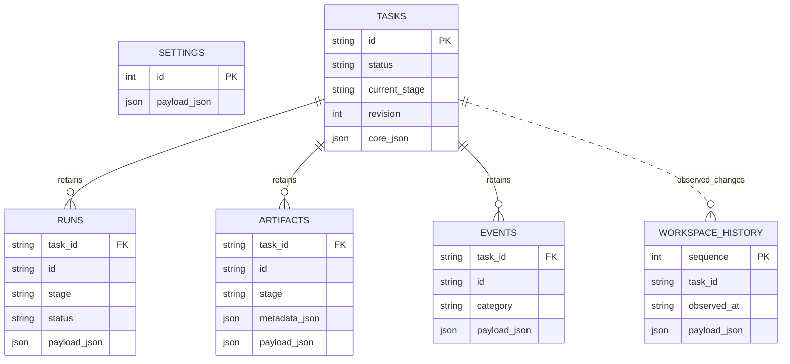

# Architect Handoff

**Audit baseline:** `main` at `0f877a906223cbf6825608f7d50804a684c389f4`, inspected 16 September 2026. This is a source-backed, read-only architectural audit, not a live service qualification. No production code, settings, database, or services were changed. The report is the sole new artifact.

## 1. What the harness is today

A **single-host, operator-controlled SDLC application**: React/TypeScript interfaces call a loopback Node.js companion, which runs local Codex and Claude CLI processes. It implements repository investigation, specification, planning, isolated implementation packages, candidate integration, review/test gates and GitHub PR delivery. It is not currently a general research-agent platform. The backend is predominantly JavaScript ES modules, with some shared TypeScript policy imports. See `server/index.mjs`, `server/api.mjs`, `server/orchestrator-core.mjs`, `package.json`.

## 2. How tasks execute

`POST /api/tasks` validates the brief, local repository and model policies, then persists a task. A separate `/api/tasks/:id/run` action reserves execution. `TaskControlOrchestrator.start()` launches an asynchronous in-process promise under an `AbortController`; no queue worker consumes the task. Fixed stage handlers build prompts, spawn a provider CLI, parse results and retain artifacts. Human decisions and approvals separate major steps. Implementation creates Git worktrees and an exact integration candidate; downstream gates bind to its revision. Approved delivery opens a PR; polling completes the task after the exact PR merges. An investigation-only task can finish with an approved specification. See `task-creation-routes.mjs`, `orchestrator-task-control.mjs`, `orchestrator-pr-lifecycle.mjs` under `server/`.

## 3. Agent and multi-agent capabilities

There are **real concurrent agent executions**, not just parallel HTTP requests: selected repository scouts run through `Promise.all`; implementation packages get independent CLI runs and isolated worktrees. Fan-in combines scout reports deterministically or integrates qualified commits. However, there is no generic parent/child agent tree, recursive delegation, mailbox, dynamic workflow interpreter or persistent agent session. Scout roles and the surrounding SDLC pipeline are fixed. Plans permit 1–8 packages; package concurrency defaults to three and is constructor-bounded to eight. See `server/orchestrator-investigation.mjs`, `server/scouts.mjs`, `server/orchestrator-work-packages.mjs`, `server/structured-output.mjs`.

## 4. Persistence, compaction and durability

SQLite retains task state, runs, artifacts and events transactionally, with WAL, full synchronization and revision-checked updates. A file lock enforces one companion per store. This is **persistent state, not durable workflow execution**: restart marks running tasks interrupted/failed for an explicit retry; it does not replay an execution journal or resume the model turn. Codex runs use `--ephemeral --ignore-user-config --disable memories`; Claude uses `--no-session-persistence`. Selected artifact excerpts and context manifests are retained; there is no harness-owned conversation compaction or persistent agent memory. CLI-internal context behavior is not established by this repository. See `server/sqlite-store.mjs`, `server/store.mjs`, `server/prompts.mjs`, `server/codex-runtime.mjs`, `server/claude-runtime.mjs`.

## 5. Model routing

Two implemented execution providers exist: Codex and Claude, using local CLI authentication rather than supplied API keys. Stage policies select model and reasoning; effective policies are snapshotted onto attempt reservations. Catalog/provider resolution is coupled to GPT/Claude identifiers. There is no local/open-weight or generic HTTP model adapter, provider rate limiter or budget-driven routing. Current default policy code differs from older AGENTS prose: standard Codex repair uses Luna XHigh with conditional escalation, and final review uses Luna Medium. Explicit persisted task overrides may differ. Cost is API-equivalent accounting, not attributable subscription billing. See `server/execution-providers.mjs`, `server/effective-policy.mjs`, `server/policy-defaults.mjs`, `server/model-catalog.mjs`.

## 6. Concurrency

One active workflow reservation is allowed per task, but there is no global model-run admission limit. Multiple tasks can each fan out. Repository verification has a process-wide FIFO semaphore, defaulting to `ceil(available cores / 2)`; package qualification is additionally serialized per orchestrator. There are no distributed workers, job leases or tenant quotas. See `server/orchestrator-runtime-base.mjs`, `server/orchestrator-task-control.mjs`, `server/verification-concurrency.mjs`, `server/orchestrator-runtime-boundaries.mjs`.

## 7. Existing research/retrieval functionality

The useful existing research capability is **bounded repository inspection**: six scout specialisms, file/line findings, confidence labels, retained reports and deterministic aggregation. Ordinary stage agents receive no network grant or configured MCP tools. There is no implemented search service, document-ingestion pipeline, PDF/OCR, embeddings, vector retrieval or claim/source evidence graph. MCP event parsing exists but does not establish MCP access. Separate prototype tooling supports Claude DesignSync and host-local browser capture of hosted design previews; it is not a general research browser. See `server/scouts.mjs`, provider spawn builders and `server/prototype-generator.mjs`.

## 8. Five architectural facts that should shape the research decision

1. **The application already delegates the inner agent loop to CLI runtimes.** It does not implement token-by-token tool orchestration itself (`runCodex`, `runClaude`).
2. **Its strongest native machinery is SDLC authority:** revision-bound plans, owned worktrees, qualified packages and fresh candidate gates (`repository-authority.mjs`, `candidate-lineage-validation.mjs`, `run-activity.mjs`).
3. **Execution is local and process-owned despite transactional persistence** (`TaskControlOrchestrator`, `acquireRuntimeLock`).
4. **Parallelism is real but domain-bounded**, with no generic research worker lifecycle (`WorkPackageOrchestrator`, scout dispatch).
5. **Security boundaries differ by execution path.** Model runs are confined through provider controls; repository verification executes unsandboxed with `process.env` (`verification.mjs`).

## 9. Five biggest gaps

1. Durable, restart-resumable jobs and distributed/tenant-aware admission.
2. Research tools, retrieval services and a claim-to-source-location verification schema.
3. Hard dollar/token/general tool budgets and global provider/model concurrency controls.
4. Persistent sessions, working memory and repository-independent long-running coordination.
5. An authenticated remote product API and extensible workflow/runtime contract beyond fixed SDLC stages.

The proposed frontier planner → 6–12 cheap/open-model researchers → frontier verifier → frontier synthesiser topology is **not supported as-is**. Model tier selection and fan-out concepts exist, but open-model execution, researcher roles/tools, 12-way fan-out, research provenance, durable lifecycle and aggregate budgets do not.

## 10. Natural external-runtime seams

The narrowest implemented seam is `resolveExecutionProvider(id).run(request)`: it accepts prompt, working directory, model/reasoning, abort signal and event callback, returning text and usage. `OrchestratorRuntimeContext` also injects execution, verification, worktree and prototype boundaries. `RetentionOrchestrator` and the store provide artifact/run recording, while polling projections feed both UIs. These are usable integration points, **not an existing interchangeable ResearchRuntime interface**. Provider IDs, model ownership, stage reservations, artifact context selection and candidate validation remain SDLC-specific. Cancellation can map to an adapter’s abort handling; remote job resume, tool inheritance and live event streaming have no equivalent contract today.

---

# Detailed architectural audit

## Scope, evidence and confidence

This report describes the checked-out implementation, not other branches, installed CLI internals, prior design documents, fixtures or deployment aspirations. Source files and named symbols are the primary evidence. Referenced tests identify executable contracts but **were not run for this audit**. No model calls, sandbox canaries, builds, task-store initialization, database writes, server starts or external searches were performed. In particular, initializing the store would run recovery and would violate the intended read-only scope.

Confidence is **high** for inspected control flow; **medium** for negative capability findings from source/dependency searches; **unverified** for actual host/provider enforcement and operational capacity. Names in bundled model catalogs are repository configuration, not an assertion of current external model availability or pricing.

The repository AGENTS instructions contain historical statements about defaults and features. Where those conflict with executable code, this descriptive audit reports the code and identifies the drift. Prototype/server-start instructions do not override the current explicit read-only audit request. No implementation plan or runtime selection is included.

## 1. Repository overview

| Component | Important locations and actual responsibility |
|---|---|
| Package/runtime | Root `package.json`: one private ESM npm application, Node >=22.13.0; no npm workspace declaration or independently versioned shared runtime package. React 19, Vite, Pixi, Markdown rendering; no agent SDK/server framework dependency. |
| Primary frontend | `src/App.tsx`, `src/api.ts`, `src/components/runtime/`: task creation, stage actions, evidence inspection, settings and polling. |
| Mission Frontier frontend | `src/frontier/app/FrontierApp.tsx`, `src/frontier/runtime/coordinator.ts`, `live-gateway.ts`, `src/frontier/world/`: alternate React/Pixi world presentation over the same API. Fixtures under `src/frontier/fixtures/` are demonstrations. |
| Shared contracts/policy | `src/domain/runtime.ts` (`RuntimeTask`, `RuntimeArtifact`, `RuntimeWorkPackage`, `RuntimeCandidate`, `RuntimeSettings`), `src/runtime-activity.ts` (`RuntimeRun`); server imports some policies from `src/`, including `workflow-recovery-policy.ts`. Shared source, not a package boundary. |
| API/bootstrap | `server/index.mjs`; `server/api.mjs` (`createApiServer`), route factories `task-creation-routes.mjs`, `task-action-routes.mjs`, `retained-evidence-routes.mjs`, `runtime-settings-routes.mjs`, `project-routes.mjs`. Native `node:http`, manual routing. |
| Orchestrator | `server/orchestrator.mjs` public `TaskOrchestrator`; `orchestrator-core.mjs` dependency wiring; separate task-control, investigation, planning, work-package, repair, candidate and gate handlers. |
| Workers/execution | `server/codex-runtime.mjs`, `claude-runtime.mjs`, `process-runtime.mjs`: spawned CLI/process workers. No worker service or worker-thread fleet. `worker/index.js` is a static hosting handler, not an agent worker. |
| Persistence | `server/sqlite-store.mjs` (`SqliteTaskStore`), `sqlite-storage.mjs`, `store.mjs` (`JsonTaskStore`, migration/record helpers), `workspace-history.mjs`. Default `.data/tasks.sqlite3`, optional legacy JSON mode. |
| Queues | In-process promise serialization for mutations/package verification, in-process bounded package scheduler and verification semaphore. No broker package or external job system. |
| Model/provider boundary | `execution-providers.mjs`, `model-catalog.mjs`, `policy-defaults.mjs`, `task-policy-snapshot.mjs`, `effective-policy.mjs`, `role-policy-eligibility.mjs`. |
| Agent/prompt boundary | `prompts.mjs` stage metadata/builders; `scouts.mjs` scout catalog; `_executeAgent()` in `orchestrator-repair-execution.mjs`; structured parsers in `structured-output.mjs`. No general Agent class with a persistent inbox/session. |
| Tools/repository | Provider built-ins; `git-worktree.mjs` (`GitWorktreeManager`), `verification.mjs` (`runRepositoryVerification`), `github-pull-request.mjs` (`GitHubPullRequestManager`). No reusable generic tool registry. |
| Artifacts | Markdown content in SQLite artifact rows; attachment files via `attachment-storage.mjs`; Git commits/worktrees for patches; prototype bundles/screenshots via `prototype-generator.mjs`. |
| Configuration | Environment variables at bootstrap, settings JSON in SQLite, local CLI catalogs/authentication, repository `.agent-harness/verification.json`, task policy snapshots. |
| CLI/dev operations | `scripts/dev.mjs`, `scripts/frontier/dev-api.mjs`, `scripts/export-task-store-json.mjs`, benchmark/QA scripts; external `codex`, `claude`, `git`, `gh`, repository verification executables. |
| Hosting | `vite.config.mjs`, `vite.frontier.config.mjs`, `.openai/hosting.json`, `scripts/prepare-sites-build.mjs`, `worker/index.js`: frontend hosting; companion remains local. `journal-site/` is a separate project journal, not a runtime service. |

Default companion binds `127.0.0.1:4310` (`server/index.mjs`), overridable with `AGENT_HARNESS_PORT`. Frontier Vite uses 5199 and proxies to 4321 by default (`vite.frontier.config.mjs`). These are source defaults, not a statement about currently running listeners.

## 2. End-to-end execution

### Creation and admission

1. `src/App.tsx` calls `createTask()` and then `runTask()`; Frontier's `live-gateway.ts` likewise exposes separate create/start calls.
2. `createTaskCreationRoutes()` accepts only `investigate` or `implement` workflow values (API `VALID_WORKFLOWS`). It validates title/description, absolute local directory, profile, model allowlist/reasoning and attachments, then captures repository authority through `RepositoryAuthorityService.capture()`.
3. `snapshotTaskPolicies()` records settings-derived/explicit policy choices. `createTaskRecord()` allocates an `AH-...` ID and stores `status: queued`, `currentStage: triage`, configuration, authority, artifacts, decisions, packages, candidates, runs, events and attempt counters. `RuntimeTask` is the frontend contract; actual construction is in `server/store.mjs`.
4. Creation alone does not execute anything. `/run` maps through `createTaskActionRoutes()` and `runActionAdmission()` to `TaskOrchestrator.start()`. This is a separate operation, not an atomic enqueue accompanying creation.
5. `TaskControlOrchestrator.start()` rejects duplicate active tasks, checks eligibility/authority, performs a conditional `store.transition()`, persists a reservation and launches `OrchestratorRunCoordinator.run()` without awaiting its completion. HTTP returns an accepted result. The in-memory `_active` map owns its promise and abort controller.

### Stage progression

`OrchestratorRunCoordinator.run()` dispatches a fixed set of run kinds. Stage identity is a string, backed by `prompts.mjs` metadata and explicit progression methods. The normal conceptual sequence is triage → scouts → Grill → specification → plan → implement → development review → test → final review → human approval. Run kinds and stages are not identical: an investigation reservation advances across several stages, while repair uses the implement stage with a repair role.

`InvestigationProgressionOrchestrator` prepares revision-bound evidence, runs triage, selects scout dispatch, aggregates scout results, and runs Grill. Open questions pause for the operator, unless the recorded automation policy authorizes accepting recommendations; zero-question sessions can continue. Specification approval can finish an investigation task or initiate planning. `approvePlan()` validates the manifest and sets `ready-for-implementation`; execution is separately admitted.

`WorkPackageOrchestrator._runImplementation()` schedules approved dependency batches. Each package gets its own worktree, model execution, owned-path checks, Git commit and repository-manifest qualification. Qualified commits are assembled in stable batch/ID order into an integration candidate. Candidate-bound gates require exact identity and current evidence. Fast-profile paths may skip full planning/scouting stages or create deterministic gate artifacts; they are not evidence that a model ran every stage (`workflow-profiles.mjs`, `orchestrator-gates.mjs`, `orchestrator-gate-evaluation.mjs`).

### Agent dispatch and result flow

`RepairExecutionOrchestrator._executeAgent()` is the central ordinary-stage execution method despite its file name. It reads the **persisted reservation's effective policy**, builds a request (`buildStageRequest`, `buildExecutionRequest`, `buildWorkPackageRequest`, or `buildRepairRequest`), creates a run record, checks confinement and invokes `_runAgent(providerId, request)`. The latter resolves the registry adapter. Providers receive prompt text over stdin and expose their own inner tool loop.

Markdown and tagged JSON come back as `finalText`; stage-specific parsers validate structured fields. `RetentionOrchestrator._finishAgentRun()` persists terminal telemetry, and `_retainAgentResult()` creates artifacts. Later prompt builders select specific prior artifacts plus task decisions and candidate context. No conversation is passed from one agent process to another.

### Failure, retry, cancellation and completion

- Process exit, timeout, missing final text, invalid structured evidence, ownership drift or failed qualification can fail a stage. `OrchestratorRunCoordinator.run()` records failure/blocking/cancellation and clears the active reservation. Candidate gate handlers distinguish repairable defects, verification gaps and stale evidence.
- Stage attempts default to three (`DEFAULT_STAGE_RUN_LIMIT`). Operator retry grants and recovery-specific allowances are persisted. One same-candidate Test retry is separately constrained; fast review allows one automatic repair cycle. Candidate repair circuit limits are fast=1, standard=2, high-risk=3 (`src/workflow-recovery-policy.ts`). This is domain-specific retry control, not HTTP/provider failover.
- `cancel()` marks `cancelling` then aborts the active controller. `runProcess()` terminates process groups (or Windows task trees), waits two seconds, escalates to force kill and waits another three. Cancellation applies to active task reservations, not arbitrary historical runs or a generic external job ID.
- `approveSpecification()` completes investigation-only tasks with the approved specification retained. For implementation, `PullRequestOrchestrator.approvePullRequest()` and `GitHubPullRequestManager.publish()` push the exact candidate SHA and open/reuse a task-specific PR. `pollPullRequests()` reconciles its identity; merge completes the task, closed/unmerged or drift blocks it. Legacy merge-recovery APIs remain, but new approval routes call PR publication.

```mermaid
sequenceDiagram
    participant U as Operator / frontend
    participant A as Node HTTP API
    participant S as SqliteTaskStore
    participant O as TaskOrchestrator
    participant P as Codex / Claude CLI
    participant G as Git worktrees + verification
    participant H as GitHub
    U->>A: POST /api/tasks
    A->>S: create task + policy/authority snapshot
    A-->>U: 201 task
    U->>A: POST /api/tasks/:id/run
    A->>O: start investigation
    O->>S: conditional reservation
    O-->>A: started (background promise)
    A-->>U: 202
    O->>P: fresh triage prompt
    P-->>O: final text + usage
    par Selected scout A
        O->>P: fresh read-only scout run
    and Selected scout B (if selected)
        O->>P: independent fresh scout run
    end
    O->>S: reports + deterministic aggregation
    O->>P: Grill / specification
    O->>S: evidence and awaiting approval
    U->>A: answers / approve specification
    A->>O: planning (or complete investigation)
    O->>P: plan prompt
    O->>S: validated packages + awaiting plan approval
    U->>A: approve plan, then implement
    A->>O: reserve implementation
    loop Dependency batches
        O->>G: isolated package worktrees
        O->>P: concurrent bounded package runs
        P-->>O: code + report
        O->>G: commit, ownership checks, qualification
        O->>S: package outcomes
    end
    O->>G: assemble exact integration candidate
    O->>S: candidate revision
    U->>A: gate actions (or configured auto-advance)
    A->>O: review / test / final review
    O->>G: harness-owned exact-candidate verification
    O->>P: independent review / interpretation where required
    O->>S: candidate-bound gates; repair loop if needed
    U->>A: approve & raise PR
    A->>O: approved candidate publication
    O->>H: push exact SHA; create/reuse PR
    loop Process-local PR polling
        O->>H: inspect PR
        O->>S: reconcile status; complete on exact merge
    end
    U->>A: GET task / activity / artifacts (poll)
    A->>S: read projections
    A-->>U: persisted results
```

The diagram groups checks/gates for readability; it does not imply all gates automatically advance or all profiles invoke the same models.

## 3. Agent and orchestration model

“Agent” below means an independent CLI execution with its own prompt/tool context, not an animated worker in Frontier.

| Capability | Status | Evidence / qualification |
|---|---|---|
| Parent/child agents | PARTIAL | Task → reservation → run and task → package relationships exist (`beginAgentRun`, `createTaskRecord`). No `parentRunId` agent tree; continuation task linkage is not delegation. |
| Subagents | PARTIAL | Coordinator launches independent scouts/packages; no general spawn-subagent API or persistent subagent lifecycle (`_runScouts`, `_runWorkPackage`). |
| Parallel agents | IMPLEMENTED | Scout `Promise.all`; package `allSettledWithConcurrency` invokes separate provider processes. |
| Recursive delegation | NOT IMPLEMENTED | No agent-accessible delegation tool, recursive coordinator or depth budget. DAG traversal recursion in plan validation is not agent recursion. |
| Agent handoffs | IMPLEMENTED | Retained artifacts and dependency commits feed subsequent stage/package prompts (`prompts.mjs`, `GitWorktreeManager`). No conversational handoff protocol. |
| Dynamic workflow generation | PARTIAL | Model produces validated package DAG and selects scouts; surrounding workflow/roles fixed (`parsePlanResult`, `selectScoutDispatch`). |
| Predefined workflows | IMPLEMENTED | `investigate`/`implement`, profile variants and fixed run kinds. |
| DAG execution | IMPLEMENTED | 1–8 packages, validated dependencies, derived batches, dependency readiness checks (`structured-output.mjs`, `orchestrator-work-packages.mjs`). SDLC-specific. |
| Sequential pipeline | IMPLEMENTED | Investigation/specification/planning/gate progression methods. |
| Fan-out/fan-in | IMPLEMENTED | Scout report aggregation; qualified package integration. |
| Agent continuation/resume | PARTIAL | Retained slice requalification/continuation and stage retry (`orchestrator-retained-package.mjs`, `orchestrator-task-control.mjs`). Fresh CLI runs, not resumed sessions. |
| Agent-to-agent communication | PARTIAL | Indirect retained reports/dependency commits. No messages/mailboxes or live peer exchange. |
| Shared context | IMPLEMENTED | Task brief, decisions, selected evidence and repository revision supplied to multiple runs. Explicit context selection, not shared conversation. |
| Isolated contexts | IMPLEMENTED | New ephemeral processes; distinct worktrees for writing packages. Scouts can share the same read-only evidence checkout. |
| Structured outputs | IMPLEMENTED | Tagged JSON parsers for scout, Grill, plan and gate results. |
| JSON Schema enforcement | PARTIAL | Hand-written validation enforces specific shapes; no arbitrary caller JSON Schema or provider response-schema constraint. |
| Approval gates | IMPLEMENTED | Explicit specification/plan/candidate approval and exact revision validation. |
| Human-in-the-loop | IMPLEMENTED | Grill answers, recorded decisions, retry grants, policy changes and gate actions. |
| Background agents | IMPLEMENTED | Outlive HTTP request through local promises/processes; do not survive coordinator loss as durable agents. |

Hard limits: scouts capped by **priority** low=1, medium=2, high=3, fast=1; zero allowed. Six available scout categories do not mean six concurrent scouts. Scout success threshold tolerates at most one failed scout when more than one is selected (`_runScouts`). Packages cap at eight, default concurrency three; siblings settle before a failed batch is reported. There is no recursive agent depth to configure.

## 4. Model architecture

### Providers and catalogs

`execution-providers.mjs` contains a two-entry registry of provider objects. The practical interface is `id`, `label`, `locate`, `status`, `catalog`, `defaults`, `capabilities`, `run`, `parseEvent`; Claude adds preflight/canary behavior. It is duck-typed JS, not an SDK-neutral model-completion interface.

`readCodexModelCatalog()` reads visible entries from `$CODEX_HOME/models_cache.json` (default `~/.codex/models_cache.json`) and falls back to bundled GPT-5.6 Sol/Terra/Luna and GPT-5.4 Mini entries. The discovered catalog is open-ended; a pricing entry alone does not make a model selectable. `readClaudeModelCatalog()` is bundled: `claude-opus-5`, `claude-sonnet-5`, `claude-fable-5`, `claude-fable-5-1`, `claude-haiku-4-5`. Haiku has explicit reasoning `none` and omits `--effort`; an older nearby comment saying it is not selectable is stale relative to the actual `CLAUDE_MODELS` array.

`providerForModelId()` classifies `gpt-*` as Codex, `claude-*` as Claude and other IDs as unsupported. No DeepSeek, Ollama, vLLM, OpenAI-compatible endpoint, Bedrock or direct hosted API adapter is wired. Existing CLI internals or account-specific providers are outside this audit.

### Policy resolution

Settings store allowlist/defaults/profile matrices; creation snapshots them; `resolveEffectiveRunPolicy()` chooses the role policy and optional same-provider repair escalation; `reserveRun()` persists it. `_executeAgent()` verifies the reservation policy before dispatch. Stage/role policy overrides support different models at different stages. All concurrent scouts currently request role `scouts`; all packages request `implement`, so there is no independent per-package/per-scout policy lookup despite individual run identities.

**Code/prose conflict:** `policy-defaults.mjs::defaultProfileStagePolicies()` currently assigns standard Codex gathering/implementation/repair Luna XHigh, planning/dev-review Sol High, final-review Luna Medium. Claude standard uses Sonnet XHigh for gathering/implementation/repair, Opus High for planning/review, Sonnet Medium for final review. `effective-policy.mjs` may escalate unpinned repair for retained material defects. Older AGENTS text says repair/final review default Sol High. This audit uses executable defaults; actual existing task snapshots may preserve other policies.

There is no parent/child model inheritance mechanism. A subsequent stage can differ from its predecessor. Subordinate scout/package runs share their owning role policy. Unknown provider/model combinations fail rather than silently switching. Bundled catalog fallback is **discovery fallback**, not failed-run model failover. Role escalation is evidence-driven, not provider outage failover or price routing.

### Accounting and limits

`parseCodexEvent()` extracts input/cached-input/cache-write/output tokens from `turn.completed`. `createClaudeStreamParser()` normalizes Claude usage and per-model details; `enrichUsage()` preserves provider-reported API-equivalent cost where available and also computes estimates. `priceUsage()` applies uncached/cached/cache-write rates; `priceCredits()` estimates comparison credits. Rate cards are stored/configurable, not billing receipts. Fable 5.1 explicitly uses placeholder rates. No external prices were verified in this audit.

Runs/artifacts retain usage; task totals are accumulated and rebuilt from artifacts (`repriceTaskUsage` in `store.mjs`). Failed ordinary runs are finished with `usage: null` in `_executeAgent()`; spent work can therefore be missing from cost totals. This cannot support a strict spend ledger. No per-provider rate limiter, per-model semaphore, 429 backoff or aggregate cost reservation exists. Provider CLIs may retry internally, but this repository does not establish their behavior.

### Requested topology

**No, not as a configuration-only use of this harness.** It has compatible ingredients—role model policies, independent processes, fan-in—but its scout fan-out stops at three; package manifests stop at eight and require Git ownership and repository verification. Twelve researchers exceed both mechanisms. Six to eight are only possible as implementation packages with a nondefault constructor concurrency, not as general researchers. Open models cannot pass existing routing/registry boundaries. Research verifier/synthesiser stages, external tools, budget enforcement and resumable research jobs are absent. This establishes the current limitation without choosing how to change it.

## 5. Context and session management

| Concern | Actual implementation |
|---|---|
| Conversation histories | No persisted ordinary-stage conversation. Codex ephemeral exec; Claude no-session-persistence. Thread/session IDs appear as activity/adapter data but are not resume handles consumed later. |
| Prompt history | Builder functions and manifests retained; full exact ordinary-stage prompt is not stored as a durable prompt log. Rebuilding later may differ if code/context changed. |
| Previous outputs | Named/latest/approved artifact selection in `stageArtifactEntries`, `executionArtifactEntries`, `approvedArtifactForStage`; decisions and exact candidate evidence included separately. |
| Context window/token growth | Character limits and estimated tokens (`ceil(prompt.length/4)`), not actual tokenizer/model-window admission. No generic total context-window manager. |
| Large artifacts | `selectArtifactContext()` strips embedded patch sections, applies per-artifact and aggregate character limits, records truncation. Omitted complete artifacts remain in storage. |
| Short-term working memory | Inside the external CLI process during one invocation; task-level facts/artifacts outside it. No harness scratchpad protocol. |
| Summarisation | Model-authored stage summaries and deterministic scout aggregation. These do not rewrite a running conversation to reclaim its window. |
| True compaction | NOT IMPLEMENTED by harness. Any automatic in-session compaction inside installed CLIs is UNCLEAR here. |
| Checkpoints | Task/stage reservations, results, package commits and candidate revisions; no tool-step continuation checkpoint. |
| Resume after interruption | Explicit fresh stage run/retained package recovery. No `codex exec resume`, Claude resume or restored conversation loop. |
| Persistent/cross-run memory | No general memory service/vector store. Codex user memory disabled. Narrow approved-investigation → implementation continuation imports artifacts/decisions (`createContinuation`, `linkTaskContinuation`). |
| Filesystem context | Source/evidence/candidate worktrees and attachment paths; Git revisions substitute for copying full patches into prompts. |
| External references | Artifact IDs and Git SHA/path metadata are recorded; ordinary prompt builders mostly inline excerpts rather than giving agents an artifact retrieval tool. |

Specific limits in `prompts.mjs`: title 300 characters; supplied task description 6,000, although creation stores up to 20,000. Stage artifact context uses 8,000 per artifact and 20,000 aggregate (plan aggregate 14,000); execution uses 5,000 per artifact/24,000 aggregate, final review 2,800/32,000; package context 12,000/24,000. These are component limits, **not a universal whole-prompt cap**. Decisions, repair evidence and other assembled sections can add text. Scout prompts cap triage at 4,000; scout report parser caps 12 findings and eight uncertainties.

`process-runtime.mjs` retains a 2 MiB stdout tail and 256 KiB stderr tail. Total stdout budget is 2.5 MiB for Codex, 32 MiB for ordinary Claude; exceeding it terminates the run. This limits host evidence output, not model context or token consumption. Tool bodies processed inside the CLI are not retained as reusable harness context.

**Would a multi-hour research task exhaust context?** Not inevitably from accumulated stages, because each stage starts fresh with selected excerpts. However, the harness provides no guarantee for a long single research agent: defaults time out in 6–15 minutes, overrides are at most one hour per stage, and there is no host-owned compaction/checkpoint loop. A CLI could compact internally or fail; neither outcome can be concluded from this repository. Longer workflows can span hours through multiple runs and human waits, with potential information loss at truncation boundaries.

## 6. Concurrency and distributed execution

- **Per task:** `_active` and persisted active reservation prevent concurrent top-level workflows on one task. Internal scout/package fan-out is allowed.
- **Per stage:** scouts use `Promise.all`; packages use `allSettledWithConcurrency()` and batch barriers. This is real multi-process agent execution controlled by JS promises.
- **Global model execution:** no aggregate admission ceiling across task IDs. The `_active` map has no capacity check.
- **Verification:** `VerificationSlots` FIFO semaphore is process-global. Default is `ceil(cores/2)`, environment override must be a positive integer. `_qualifyPackage()` additionally chains onto a per-orchestrator promise queue. Verification captures revision after acquiring its slot (`runRepositoryVerification`).
- **Per model/provider/project/customer:** no quotas or separate fair queues. Projects are organizational/repository associations.
- **Distributed machinery:** no worker threads, Redis, Postgres job tables, Temporal, BullMQ, pg-boss, message broker or worker registration/lease protocol in runtime source or package dependencies. Child processes and SQLite are the execution/storage mechanisms.

| Scenario | Consequence supported by code |
|---|---|
| 10 agents simultaneously | Possible across tasks, subject to OS/CLI/account capacity. No global model-run check; verification may wait. No measured throughput assertion. |
| 100 agents simultaneously | No architecture-level model admission cap prevents attempted starts across tasks. CPU/memory/process/account pressure is likely, but exact failure threshold is unmeasured. Package caps do not protect aggregate load. |
| Several customers submit | No customer identity/isolation/quota model. Local callers share settings, credentials, store and host resources; public remote use is not the current deployment boundary. |
| Provider rate limits | CLI may handle internally; surfaced failures fail/block a stage. No repository-owned Retry-After scheduling or model failover. |
| CLI worker dies | Nonzero/empty output fails run; timeout handles a hung child while parent survives; partial usage may be lost. |
| Companion dies | In-memory promises/controllers/queues disappear. Detached children are not guaranteed dead after abrupt parent termination. No persisted child-PID reclamation protocol found. |
| Companion restarts | Lock must be obtainable; recovery changes running state to interrupted/failed, requiring new admission. PR polling resumes separately. |

A package's failure does not immediately cancel successful siblings: the bounded all-settled scheduler waits for outcomes and may start remaining items in that batch. This preserves results but is not a fail-fast aggregate-budget policy. SQLite `DatabaseSync` calls run on the companion event loop; large task hydration and synchronous transactions are another single-process consideration.

## 7. Scheduling, persistence and durability

`SqliteTaskStore.init()` uses foreign keys, WAL, `synchronous=FULL`, busy timeout 5 seconds; writes use `BEGIN IMMEDIATE` and revision predicates. A serialized promise queue coordinates store mutations. Schema version 3 and task schema version 10 are separate from HTTP runtime schema version 12. Legacy JSON import performs parity/hash checks and retains its source. Optional `JsonTaskStore` writes via queued file replacement; it is not an alternative distributed store.



`runs`, `artifacts`, `events` use composite `(task_id,id)` keys and ordinals. Packages, candidates, revisions, approvals, reservations, decisions and PR intents are nested in `tasks.core_json`, not independently scheduled job rows. Projects are in the singleton settings payload, not a tenant table. `metadata` tracks import/source identity and history coverage; `schema_migrations` records schema migration versions. Workspace history has a task ID but no declared task foreign key.

| Capability | Status and meaning |
|---|---|
| Durable jobs | PARTIAL: durable task/reservation/results; no durable execution/replay. |
| Scheduled/recurring/delayed jobs | NOT IMPLEMENTED for tasks. PR reconciliation timer is a specific periodic background function, not a scheduler API. |
| Job leases | NOT IMPLEMENTED. Exclusive file lock has ownership token/PID/time, no expiry, renewal or work lease. |
| Heartbeats | NOT IMPLEMENTED for agent liveness. Started/finished records and UI polling are not a worker heartbeat. |
| Orphan recovery | PARTIAL: interrupt stored running tasks; attachment orphan cleanup; worktree recovery paths. No detached worker reclamation. |
| Idempotency | PARTIAL: conditional admission/reservation and exact-PR reuse protect specific transitions. Task creation has no caller idempotency key; Git/API and DB effects are not one transaction. |
| Restart resumability | PARTIAL: retained evidence/commits permit retry, PR/legacy merge reconciliation has explicit recovery; no automatic continuation of arbitrary stages. |
| Checkpoints | PARTIAL: semantic stage/candidate checkpoints, not executable stack/tool checkpoints. |
| Event sourcing | NOT IMPLEMENTED. Mutable task authority plus synchronized/upserted/deleted collections. Workspace history is a bounded observation log, not replay authority. |

`migratePersistedTaskState()` recovers `running` and design-generation states explicitly. Its normal interrupted-run branch checks `task.status !== "running"` and skips others; an abrupt crash after recording `cancelling` is not covered by that branch. Normal shutdown awaits cancellation before closing storage; crash-window behavior is weaker. `acquireExclusiveFileLock()` refuses any existing lock and does not automatically prove/remove stale ownership. An unclean crash may therefore require lock intervention before recovery can run.

`RUN_ACTIVITY_EVENT_LIMIT` bounds high-volume task events to 2,000 while preserving other categories; `WORKSPACE_HISTORY_LIMIT` prunes workspace observations to 5,000. Neither provides an immutable complete execution audit trail.

## 8. Tools and MCP

The harness **does not own the generic tool-call loop**. It gives a prompt and capability posture to a CLI; the CLI discovers/executes its built-ins and inserts results into its own context. Parsed stdout events are observational, not a server-side tool dispatcher.

| Tool capability | Current path and boundary |
|---|---|
| Definitions/registration | Claude fixed allowlists; Codex CLI built-ins. No tool schema registry or per-project tool configuration endpoint. |
| Agent differences | Read-only vs workspace-write posture. Claude read-only: Read/Grep/Glob/Bash; write adds Write/Edit. Host capacity fallback can remove Bash for read-only. |
| MCP | Both parsers understand MCP event shapes. Ordinary Codex ignores user config; Claude strict MCP config supplies no servers and exposes only listed built-ins. Configured ordinary-stage MCP access is NOT IMPLEMENTED. |
| Shell/code execution | CLI command/Bash tools under provider confinement; repository verification via direct `runProcess` outside that confinement. |
| Filesystem | Source/evidence reading; candidate/slice writing; validated attachments; explicit Claude read roots/files. |
| Git/GitHub | Harness-owned GitWorktreeManager and GitHubPullRequestManager; controlled lifecycle operations, not a general model GitHub-tool catalog. |
| HTTP/generic APIs/web search | No ordinary-stage network grant or configured research tools. CLI API authentication traffic is separate from agent tool network access. |
| Browser automation | Prototype screenshot subprocess and DesignSync exception below; no general browser agent API. |
| Database access | SQLite is host-owned state. No model SQL tool exposed. |

`_executeAgent()` passes `networkAccess: false`. Codex's `buildCodexSpawnArgs()` chooses read-only/workspace-write sandbox, disables memory and ignores user configuration. Claude's `buildClaudeSpawn()` sets safe mode, strict MCP config, explicit tools and a new nonpersistent session; `buildClaudeSandboxSettings()` denies unsandboxed command escape, restricts file access and tool network. Actual enforcement depends on installed CLI/platform behavior; provider capabilities are declarations, and Claude adds host canaries plus source checks.

**Design exception:** `prototype-generator.mjs::claudeDesignArgs()` enables only `DesignSync`, with `bypassPermissions`, to create/publish a hosted design. This is a narrow external-service path with distinct semantics, not evidence of general MCP/research access. Hosted Claude previews are captured by a host-local headless Chrome process (`captureClaudePreview`), with a validated claudeusercontent.com URL, a temporary browser profile and a 60-second timeout. Ordinary stage controls must not be assumed to cover every auxiliary execution path identically.

`conciseToolResult()` intentionally stores shape/size instead of full payload. Codex command results usually retain exit code; command strings cap at 220 characters. There is no generic content-addressed tool-output store/retrieval API. Full source files and authored artifacts can persist externally to the model context, but this is not automatic externalization of every tool response.

## 9. Web and research capabilities already present

| Capability | Finding |
|---|---|
| Search APIs (Exa/Tavily/Serper/Bing/Google etc.) | NOT IMPLEMENTED in runtime/dependencies. |
| Web fetch/scraping/Firecrawl | No general retrieval integration. Hosted design URL collection/preview references do not implement web research. |
| Browser/Playwright | `prototype-generator.mjs::captureClaudePreview()` opens a validated hosted Claude preview in headless Chrome (`--screenshot`, `--dump-dom`). `verification.mjs::parsePlaywrightJsonReport()` ingests repository test reports, and manifest commands can run a target repository’s Playwright suite. Neither is a general research browsing tool; no Playwright dependency in the root package. |
| Document ingestion | Limited user attachment storage: HTML/images/ZIP, max six files, 5 MB each and 6 MB combined (`api.mjs::validateAttachments`). No document chunk/index ingestion. |
| PDF extraction/OCR | No implemented pipeline; PDF is not in the creation attachment allowlist. CLI ability to inspect a repository document is outside a harness ingestion contract. |
| Embeddings/vector stores/pgvector/RAG/reranking | NOT IMPLEMENTED. |
| Lexical/full-text search | Repository searches via CLI rg/Grep/Glob and task filtering. No corpus full-text index or SQLite FTS research service. |
| Knowledge graph | NOT IMPLEMENTED. Package dependency graph is execution structure, not a knowledge graph. |
| Citations | Repository scout findings carry file/line/fact/confidence; Markdown citations are prompted. No general citation resolver. |
| Source snapshots | Git revision-bound evidence worktrees and design bundle hashes. No fetched-page snapshot store with timestamp/location bindings. |

Negative findings come from inspecting package dependencies and runtime source, with searches for retrieval, queue, tracing and session mechanisms. Research-looking names in `src/frontier/fixtures/scenarios.ts` and prototype text such as heartbeat claims are UI-only sample data.

## 10. Artifacts and evidence

`RuntimeArtifact` and `_retainAgentResult()` support durable Markdown with ID/run/stage/name/content, times, model/reasoning, usage, repository authority and candidate/package binding, context manifest, focused-test data and gate results. Ordinary artifacts always use `kind: markdown`; structured data is parsed out and retained in typed task/gate fields, not exposed as an arbitrary artifact schema selected by a caller.

| Output | Persistent support |
|---|---|
| Markdown/report | IMPLEMENTED: SQLite artifact payload. |
| JSON/structured records | IMPLEMENTED for specific plan/scout/Grill/gate/runtime fields; not general outputSchema support. |
| Files/code patches | IMPLEMENTED: Git worktree/commit; candidate and package diffs loaded from exact revisions on demand. |
| Screenshots/HTML | IMPLEMENTED for prototype bundles and validated image attachments; not a general screenshot evidence workflow. |
| External object storage | NOT IMPLEMENTED. Local paths and Git are availability dependencies; hosted design links are provider-owned exceptions. |

### Claim provenance assessment

The requested chain is **PARTIAL, insufficient as a general research evidence model**:

| Required link | What exists |
|---|---|
| Claim | Scout `fact`, gate finding/title/detail; no generic claim entity. |
| Source | Repository file and authority revision; optional design source URL/bundle hash. |
| Exact location | Scout numeric line and gate file/line; no page/bounding box/text range/URL fragment schema. |
| Retrieved timestamp | Run/artifact/authority timestamps; no per-source retrieval timestamp. |
| Supporting text/data | Freeform finding detail/reproduction evidence; no mandatory quoted extract/source blob binding. |
| Researcher | Artifact/run/role/model attribution. |
| Confidence | Scout high/medium/low labels, model-reported. |
| Verifier result | Candidate-bound PASS/REPAIR and deterministic repository tests; not claim-by-claim corroboration or contradiction. |

`parseScoutReport()` validates shape/coerces bounds but does not check that the cited line proves the fact. `parseGateEvidence()` validates candidate identity and actionable findings; that provides strong **software revision provenance**, not factual verification of arbitrary external research. Context manifests establish what was supplied, not what a model read, relied on or verified.

## 11. Observability

| Signal | Retention and UI |
|---|---|
| Runs/stages | `beginAgentRun`, `completeAgentRun`, `RuntimeRun`: role, stage, model/provider, policy, attempt/reservation, time, status, error, candidate/package identity. Rendered by runtime panels and Frontier AgentPanel. |
| Tokens/cache/cost | Run/artifact usage, task summaries, API-rate/credit estimates; `RuntimeWorkspaceFooter`, `RuntimeInspectorPanels`. Failed-run spend incomplete. |
| Tool calls | Provider parsers normalize started/completed summaries; `_finishAgentRun()` persists the last 100 runtime activity entries into task events. Full outputs omitted. |
| Live progress | Start record is persisted immediately; ordinary `_executeAgent()` buffers tool events in memory until finish. Polling can show a run active without incremental command telemetry. |
| Prompts | Context manifest: sources, sizes/truncation, repository scope and estimated prompt tokens. No full prompt transcript store. |
| Responses | Retained final artifact text, structured gates/results. Intermediate agent messages are not a full transcript. |
| Retry/repair | Reservations, attempts, grant evidence, candidate revisions and stale gate reasons inspectable through task/evidence views. |
| Traces | No Langfuse or OpenTelemetry runtime integration. Correlation IDs exist locally; no distributed trace propagation. |
| HTTP | `send()` reports duration/bytes/server timing; bootstrap logs slow/large responses or configured metrics. These console records are not a dedicated UI trace view. |
| Operational errors | Console logging for bootstrap/shutdown/PR poll failures; stage errors retained when store available. |
| Parent/child | Task/package/run associations and continuation task IDs, not generic agent ancestry. |

`retained-evidence-routes.mjs` exposes paginated activity/runs/artifacts; `src/App.tsx` and `src/frontier/runtime/coordinator.ts` poll version markers before refreshing details. There is no SSE/WebSocket token/tool stream. Workspace history supports return briefings and watched-run observations, with bounded coverage and source identity. UI artifacts/diffs/Grill/gate controls are implemented; actual usability was not exercised during this source audit.

## 12. Cost and execution controls

| Control | Status | Enforcement |
|---|---|---|
| Per-run/task/agent dollar budget | NOT IMPLEMENTED | No reservation/debit/check against a money ceiling. |
| Maximum input/output tokens | NOT IMPLEMENTED | Prompt excerpt character limits and token estimates are not token limits on generation. |
| Maximum tool calls | PARTIAL | Candidate review/test/final-review repository-command starts capped at 10/2/2 in `_executeAgent()`. Other stages have prompt instructions, not a general tool meter. |
| Maximum runtime | IMPLEMENTED per process/stage | `stageTimeoutMs`: implement 900s; plan/dev-review/final-review or write posture 600s; other ordinary stages 360s. Internal stage overrides allowed from default up to 3,600s. No whole-task wall deadline. |
| Maximum children | PARTIAL | 1–8 work packages, scout cap 0–3, package concurrency; no generic child agent concept. |
| Maximum research depth | NOT IMPLEMENTED | Scout read/search limits are instructions; dependency graph size is SDLC-specific. |
| Provider/model budgets | NOT IMPLEMENTED | Rate cards/selection do not enforce expenditure. |
| Early termination | IMPLEMENTED | Abort signal, timeouts, output-volume ceiling and review-command abort. |
| Budget-aware routing | NOT IMPLEMENTED | Profile/role/evidence-based policies; no remaining-budget input. |
| Retry bounds | IMPLEMENTED | Stage attempts, candidate repair circuit, specific retry grants. Not an aggregate spend cap. |

The command limit observes a **started** tool event and aborts once the count exceeds the limit. Thus it is a reactive stop, not proof the disallowed next command never began. stdout-volume limits likewise stop after receiving excess bytes. These are meaningful guards but cannot guarantee a hard financial ceiling.

Verification commands use their own manifest timeouts (`verification.mjs`); a workflow with many commands/runs/waits can exceed any individual stage duration. Costs primarily track retained successful output; the ordinary failure path's null usage is material for research budgeting.

## 13. Security and isolation

| Boundary | Nature / limit |
|---|---|
| HTTP access | Listener bound to loopback; Host/Origin validation and per-process CSRF header (`http-security.mjs`). No authenticated user/tenant principal. Token available via local status endpoint. |
| Model environment | Explicit provider environment allowlists; ordinary API key/base URL variables excluded. Authentication delegated to existing CLI profile; no harness key vault. |
| Codex tools | `--sandbox read-only/workspace-write`; capability declares OS enforcement. No canary in this adapter. Audit did not prove installed-host enforcement. |
| Claude tools | Explicit allowed tool set, file permissions, OS Bash sandbox, no unsandboxed escape, host canaries, source verification. Layered rather than one universal OS boundary. |
| Worktrees | Protect target checkout and bind output to candidate revisions. Owned-path and clean-state checks enforce correctness after execution. Git worktrees are not containers or tenant isolation. |
| Repository verification | Runs repository-controlled argv unsandboxed with full `process.env`. Direct argv prevents implicit shell interpretation by the harness, but the program itself can execute shell/network/code. A trusted manifest/repository is required by the actual boundary. |
| Dependencies | Worktree provisioning can link existing dependency directories; these are shared host resources (`git-worktree.mjs`). Not per-customer filesystem/credential isolation. |
| Attachments | `validatedAttachmentReadPaths()` checks managed paths and rejects escapes; Claude stages copy attachments to neutral temporary paths and grant exact reads. |
| GitHub credentials | Host git/gh configuration/environment; trusted harness operations use them. Not per-tenant delegated credentials. |
| Prompt injection | Prompts mark task/repository/evidence untrusted and constrain action. These are instruction-level defenses; parsers, file/sandbox controls and gate validation are separate technical controls. |
| Arbitrary web content | No ordinary research retrieval path, sanitizer/source trust model or web prompt-injection workflow. Prototype preview has a separate limited serving path. |
| MCP credentials | No ordinary configured MCP server/credential store to inherit. DesignSync depends on CLI/platform configuration. |

Source snapshots and post-run cleanliness checks detect certain mutations; they do not prevent secrets from being read or repository commands causing non-file side effects. Environment filtering is not file-level secret discovery/redaction. No customer authorization, encryption-at-rest service, secret-scanning pipeline or tenant-scoped sandbox manager is implemented in the inspected runtime.

## 14. API and integration surface

| API | Actual purpose |
|---|---|
| `GET /api/health`, `/api/runtime/status` | Runtime contract/version, provider status/settings/CSRF token. Status may run CLI probes; it is not assumed side-effect-free for this audit. |
| `POST /api/tasks` | Create repository-bound investigate/implement task. No objective/context/budget/outputSchema research contract. |
| `POST /api/tasks/:id/run` | Admit investigation asynchronously. |
| `POST /api/tasks/:id/{implement,review,test,final-review,repair,...}` | Deterministic stage actions subject to `action-policy.mjs`/retry admission. |
| `POST /api/tasks/:id/cancel` | Abort currently active local task. |
| `GET /api/tasks?view=...`, `GET /api/tasks/:id?view=...` | Summaries/core/poll versions/full task projections. |
| `GET /api/tasks/:id/{activity,runs,artifacts}` | Paginated evidence; individual artifact and run routes also exist. |
| `GET /api/workspace/history` | Bounded sequence-based material observations for briefings. |
| Grill/approval/policy/continuation routes | Operator decisions, approved handoffs and eligible future policy edits. |
| `/api/settings`, `/api/projects` | Local configuration/project registry; not tenants. |
| `POST /api/companion/questions` | Synchronous read-only Codex-backed answer; 120s timeout. Separate from tracked task execution. |

Native `node:http`, JSON responses and manual route factories; no Express/Fastify dependency. Mutations require JSON and `x-agent-harness-csrf`, and allowed browser origins. A loopback nonbrowser client can use the CSRF flow, but this is not service authentication. There are no external webhooks, callback URL contract, queue integration, WebSocket or SSE endpoints.

**Integration difficulty today:** a product process on the same trusted machine can create a valid local repository task, start it separately and poll artifacts/status. It must handle approvals and SDLC states, and creation/start are not atomic. A remote multi-customer product cannot use this as a production research-job API without changes to authentication, lifecycle/domain contracts, durability and isolation. This assessment does not define a new endpoint.

The Companion is a useful exception to note: `createCompanionChatRoutes()` defaults directly to `runCodex`; `selectCompanionPolicy()` deliberately chooses a Codex policy. It returns usage in the HTTP response but does not create a tracked stage run, persisted conversation or shared cost admission. Not all model calls go through the main provider registry.

## 15. Extension seams for an external research runtime

These are observations about existing boundaries, not an implementation plan.

| Seam | Existing contract | What it does not supply |
|---|---|---|
| Execution provider registry | `resolveExecutionProvider(id).run(request)`; provider-specific spawn/auth/parse/capabilities behind one object. | Generic job/session handles, tool catalogs, arbitrary output schema, worker scheduling. Provider IDs repeated in `run-activity.mjs`, `effective-policy.mjs`, model mapping and validation; adding a Map entry alone is insufficient. |
| Runtime dependency wiring | `OrchestratorRuntimeContext` options: `runCodex`, worktree manager, verification, repository authority, prototype generator. | A generalized workflow-runtime interface. `runCodex` injection bypasses provider/confinement paths and package verification defaults in tests; it is not automatically a safe production adapter strategy. |
| Agent request/execution | `_executeAgent()` builds prompt, verifies policy, passes signal/onEvent and receives result/usage. | Repository-independent research job contract; it assumes known stage, role, reservation, cwd and confinement posture. |
| Artifact/run retention | `_finishAgentRun`, `_retainAgentResult`, `SqliteTaskStore` records/projections. | External artifact upload API, arbitrary event ingestion protocol, claim schema or continuous event persistence. |
| Workflow handler composition | `TaskOrchestratorCore` composes separate investigation/planning/evaluation/package handlers. | Pluggable arbitrary stage graph; API/types/actions/gates/context selection encode SDLC semantics. |
| Alternate UI gateway | Frontier `live-gateway.ts` and coordinator consume API projections. | Backend runtime portability; fixtures show interface substitution, not interchangeable execution engines. |
| Prototype generator | `createPrototypeGenerator` injection and retained external URL/bundle metadata demonstrate an auxiliary external result path. | Research tool permission/context/budget inheritance. |

Could a `ResearchRuntime` family coexist without destabilizing SDLC? **The code offers boundaries, but no such interface exists to establish that guarantee.** A single externally executed, bounded stage can conceptually satisfy the provider request/result shape. A multi-hour runtime owning its own decomposition/session/checkpoints cannot simply be treated as a drop-in CLI call while assuming those lifecycle capabilities propagate into the store/UI. Compatibility would need to be demonstrated; no runtime is selected here.

| External-runtime interaction | Present support |
|---|---|
| Use model configuration | PARTIAL: adapters receive selected model/reasoning; catalogs/provider ownership are GPT/Claude-specific. |
| Report usage | IMPLEMENTED seam for normalized returned usage; no live budget debit, and arbitrary new model rates require recognition. |
| Stream events to UI | PARTIAL: request has `onEvent`; ordinary events buffer until run completion, UI polls persisted projections. |
| Publish artifacts | PARTIAL: internal retention/store methods; no authenticated external ingestion service. |
| Participate in stages | PARTIAL: satisfy known request/result/validation contract; new stages are not declaratively registered. |
| Inherit task/project context | PARTIAL: explicit task prompt/authority construction; no generic customer data context service. |
| Access configured tools | NOT IMPLEMENTED as a shared facility. Tools are CLI-specific and ordinary MCP configuration is suppressed. |
| Cancel | PARTIAL: AbortSignal is a useful adapter seam; remote cancellation acknowledgement/reconciliation not modeled. |
| Resume | NOT IMPLEMENTED at session/job adapter level; only fresh stage retry using retained domain evidence. |

## 16. Harness infrastructure implemented locally

Ratings assess fitness for the current local SDLC boundary, with limitations for research. They do not rate third-party CLI internals.

| Category | Rating | Evidence |
|---|---|---|
| Context management | BASIC | Selected/capped artifacts, manifests, patch omission (`prompts.mjs`); no token-aware context orchestration. |
| Summarisation | BASIC | Scout aggregation and stage Markdown reports (`scouts.mjs`); targeted handoffs, not a generic summarizer. |
| Compaction | NOT PRESENT | No conversation rewrite/checkpoint mechanism; ephemeral provider calls. |
| Session persistence | NOT PRESENT | Explicitly disabled in provider spawn arguments. Task persistence is separate. |
| Agent delegation | BASIC | Fixed scout/package fan-out in orchestrators; no recursive tool protocol. |
| Subagent management | BASIC | Start/finish/abort/attempt metadata per child run; no generic ancestry/inbox/resume. |
| Workflow execution | ADEQUATE | Explicit stage admission, package DAG, revision gates, repairs and approvals with focused tests. Domain-specialized, not generic durable workflow engine. |
| Retry logic | ADEQUATE | Persisted reservations, retry authority, grants, bounded repairs and exact-candidate retries. No provider backoff/failover. |
| Queueing | BASIC | In-process promise queues/semaphore; no durable delivery or distributed admission. |
| Model abstraction | ADEQUATE | Two real adapters, normalized usage and policy snapshots. Classification/constraints remain provider-specific. |
| Tool abstraction | BASIC | Normalized telemetry and CLI allowlists; no generic definitions/dispatch/context externalization. |
| Sandboxing | ADEQUATE for model stages | Provider flags, Claude canaries and file validation; not blanket isolation for verification or customers. |
| Memory | NOT PRESENT | No general persistent agent memory; explicit artifact handoffs only. |
| Scheduling | BASIC | Bounded package batches and PR poll timer; no general timed/recurring task scheduling. |
| Task persistence (separate from sessions) | ADEQUATE | SQLite transactions, revision checks, import parity and semantic recovery. Not durable model execution. |

No category is called MATURE solely because it has many tests or historical design documentation. The lack of a generic feature is often a deliberate scope boundary, not automatically poor code quality. Much difficult inner-loop infrastructure is already delegated to Codex/Claude, but which features those CLIs provide internally must be assessed separately.

## 17. Architectural constraints relevant to research

1. **Single-host ownership, no global model admission.** A map controls active task IDs, not population size. Research fan-out across many jobs can exceed host/account capacity (`orchestrator-runtime-base.mjs`, `TaskControlOrchestrator.start`). High confidence.
2. **Persistent state is not an executable durable job.** Crashes lose promise/controller state; lock/recovery require local intervention/retry. No tool checkpoint or lease (`store.mjs`, `runtime-lock.mjs`, `process-runtime.mjs`). High confidence.
3. **Provider coupling extends beyond the registry.** GPT/Claude model classification, repeated provider sets, policy snapshots and companion bypass limit plug-and-play runtimes (`model-catalog.mjs`, `effective-policy.mjs`, `companion-chat.mjs`). High confidence.
4. **Research is forced into repository/candidate semantics today.** Task creation requires a local repository; dynamic packages require owned paths and verification commands; gates require candidates. These are substantive domain constraints, not just UI labels. High confidence.
5. **Tools/network unavailable for ordinary research.** MCP telemetry parsing cannot substitute for configured MCP discovery/access; no retrieval layer (`codex-runtime.mjs`, `claude-runtime.mjs`, `_executeAgent`). High confidence for configured path; CLI builtin internals unverified.
6. **No enforceable aggregate spend budget.** Costs may omit failed work, and command limits are narrow/reactive. All-task accounting cannot be used as a reliable hard budget (`orchestrator-retention.mjs`, `_executeAgent`, `model-catalog.mjs`). High confidence.
7. **No customer security boundary.** Loopback operator trust, shared credentials/filesystem, unsandboxed repository verification. Current path must not be described as safe execution of arbitrary hostile repositories (`verification.mjs`, `http-security.mjs`). High confidence.
8. **Research provenance is not represented.** Strong candidate lineage exists, but no claim/source snapshot/location/retrieval/verification graph (`scouts.mjs`, `structured-output.mjs`). High confidence.
9. **Context is lossy and sessionless.** Excerpts can omit material source detail; no persistent researcher conversation. Whole prompt size is not universally capped even though artifact portions are (`prompts.mjs`). High confidence.
10. **Observability is terminal-heavy and bounded.** Ordinary tool activity buffers until completion, outputs are elided, events pruned; no replay trace for hours of research (`_executeAgent`, `orchestrator-retention.mjs`, `workspace-history.mjs`). High confidence.
11. **Host-local artifacts and filesystem assumptions.** Git/attachments/prototype files are not a shared artifact service; external workers cannot rely on local paths (`attachment-storage.mjs`, `git-worktree.mjs`). High confidence.
12. **Domain policy shared through frontend tree.** Backend imports TypeScript recovery policies from `src/`; runtime types/actions/projections assume known SDLC stages. A new workload cannot be treated as a UI-only change (`orchestrator-task-control.mjs`, `src/domain/runtime.ts`). High confidence.

Relevant tests available for future verification include `tests/runtime-process-provider.test.mjs`, `tests/claude-runtime.test.mjs`, `tests/runtime-prompts-context.test.mjs`, `tests/sqlite-store.test.mjs`, `tests/verification-concurrency.test.mjs`, `tests/orchestrator-candidate-assembly.test.mjs`, `tests/orchestrator-pr-publication.test.mjs`, `tests/api-contract-characterization.test.mjs`, and `tests/orchestrator-runtime-policy.test.mjs`. Their presence does not establish they pass at this revision. This audit did not execute them.

## 18. Final capability matrix

Statuses refer to the harness itself. PARTIAL identifies a material scope boundary, not a hidden promise of general support.

| Capability | Status | Implementation | Confidence | Important notes |
|---|---|---|---|---|
| Multi-model routing | IMPLEMENTED | `execution-providers.mjs`, `effective-policy.mjs` | High | Codex/Claude; no open-model/HTTP adapter. |
| Per-agent model selection | PARTIAL | Task role policies, reservation `effectivePolicy` | High | Per role/stage; scouts/packages share owning role policy. |
| Parallel agents | IMPLEMENTED | `_runScouts`, `_runImplementation` | High | Independent CLI processes; local bounded fan-out. |
| Subagents | PARTIAL | Scout/package runs | High | No generic child lifecycle/tree or recursive spawning. |
| Fan-out/fan-in | IMPLEMENTED | `aggregateScoutReports`, package integration | High | Fixed repository/SDLC semantics. |
| Durable execution | PARTIAL | `SqliteTaskStore`, interrupted-state recovery | High | State durable; execution not replayed/resumed. |
| Session resume | NOT IMPLEMENTED | Ephemeral/no-session-persistence spawn flags | High | Stage/retained worktree retry differs from session resume. |
| Context compaction | NOT IMPLEMENTED | Prompt excerpts only | High for harness | Installed CLI internal compaction unclear. |
| External memory | NOT IMPLEMENTED | No memory service; user memory disabled | Medium-high | Artifacts/continuation handoffs exist. |
| Structured outputs | IMPLEMENTED | `structured-output.mjs`, `scouts.mjs` | High | Fixed parsers, not arbitrary JSON Schema. |
| Tool permissions | IMPLEMENTED | Provider sandbox/settings/tool allowlists | High for code | Host enforcement untested; verification unsandboxed. |
| MCP | PARTIAL | Provider MCP event parsers | High | No ordinary-stage servers registered; parser is telemetry. |
| Web search | NOT IMPLEMENTED | No research search integration | Medium-high | No configured ordinary-stage tool; external CLI behavior not audited. |
| Browser automation | PARTIAL | Hosted-design headless screenshot capture | High | No agent-facing research browser. |
| RAG/retrieval | NOT IMPLEMENTED | Repository inspection only | Medium-high | No ingestion/index/vector retrieval service. |
| Evidence provenance | PARTIAL | Context manifests, file/line facts, candidate lineage | High | No generic claim-source-verification chain. |
| Scheduling | PARTIAL | Package batches, PR poll timer | High | No user timed/recurring/delayed job scheduler. |
| Cost tracking | IMPLEMENTED | `enrichUsage`, run/artifact usage | High | API-equivalent; incomplete failure spend, placeholder rates. |
| Hard budget enforcement | PARTIAL | Time/output/attempt/review-command bounds | High | No hard dollar/token/whole-job budget. |
| Cancellation | IMPLEMENTED | AbortController + process-tree termination | High for code | Local active task; no remote job cancellation protocol. |
| Distributed workers | NOT IMPLEMENTED | Single runtime lock/in-process coordinators | High | Child processes are not a distributed worker system. |
| Observability | PARTIAL | Runs/events/artifacts/history, HTTP metrics | High | Polling, terminal-buffered tools, no complete trace. |
| Product/API integration | PARTIAL | Local JSON task/actions/evidence API | High | Loopback trusted operator, fixed SDLC, no remote auth/callbacks. |

## 19. Questions for Shaun

1. Will research jobs execute only on a trusted operator machine, or must the platform serve multiple customers remotely? What customer-data and execution isolation boundary is required?
2. What are the expected simultaneous jobs, researchers per job, typical/worst-case duration and acceptable recovery delay after host loss?
3. Which customer/project data sources and external research tools already exist outside this repository, and what access, retention and regional restrictions apply to them?
4. Must research survive host failure automatically, or is explicit operator retry from retained evidence acceptable for an initial operational boundary?
5. What does a hard budget mean operationally: provider-billed dollars, API-equivalent estimates, subscription credits, or a separate platform allowance? What overshoot, if any, is acceptable?
6. What services currently back up/restore the local database, Git refs, attachments and prototype bundles, if any? None are established by this runtime code.
7. Are the installed Codex/Claude versions and authentication modes controlled across intended hosts, and are any externally managed tools/runtime services available beyond the configurations represented here?
8. What source granularity and verification standard must a research deliverable satisfy—for example quoted passages with page coordinates, immutable source snapshots, independent verification, and required retention duration?

These are operational/product inputs the repository cannot establish. They are not prerequisites for understanding the current implementation and do not select a research runtime.
