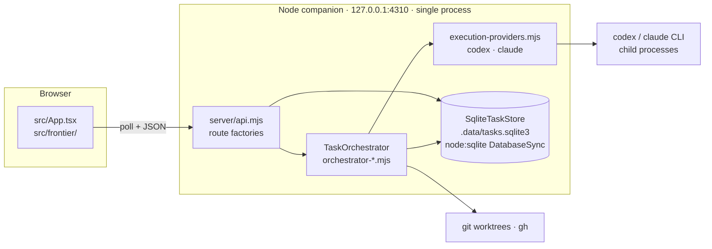
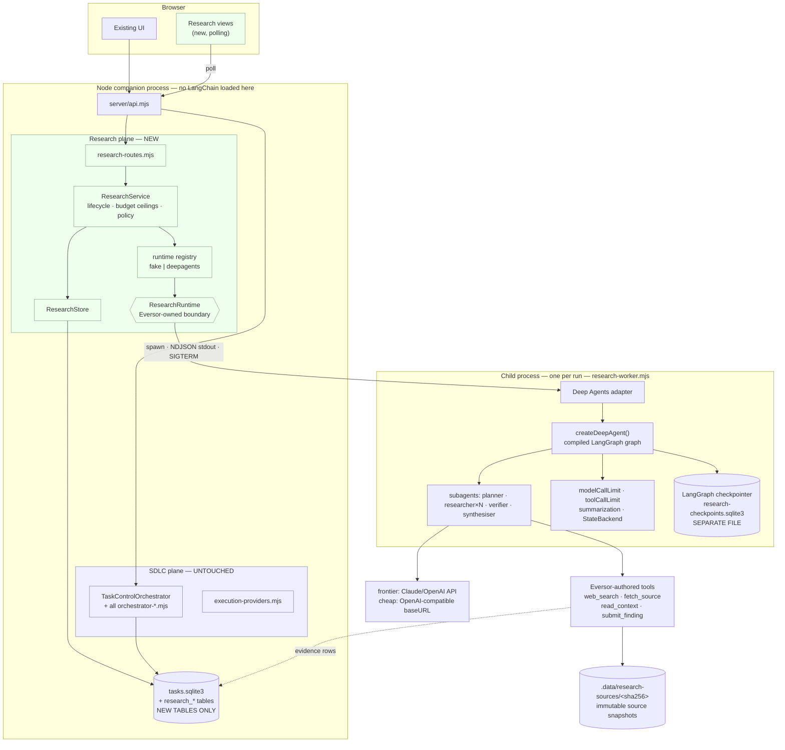

# Research Runtime Architecture — Deep Agents JS as First Candidate

**Author role:** principal architect (Prompt 1, `research-agent-deepagents-spike-pack/prompts/01-ARCHITECT-DEEP-AGENTS.md`)
**Date:** 16 September 2026
**Repository baseline:** `agent-harness-ui` @ `main` (`6773f41`), working tree as inspected on 16 September 2026
**Audit baseline consumed:** `HARNESS-RESEARCH-AUDIT.md` (audited `0f877a90`)
**Status:** design only. No production code was modified.

---

## 0. Evidence standard and a note on the spike pack

Everything labelled **VERIFIED** below was checked in this session, either by reading repository source or by reading the current published package metadata / type declarations / official docs. Everything labelled **INFERRED** is a reasoned conclusion that the spike must confirm empirically. Everything labelled **UNVERIFIED** is a claim I could not ground and which must not be designed against.

External facts were taken from the npm registry and from the published `.d.ts` of the exact versions named, not from memory. Where the prose docs and the type declarations disagreed, the type declarations win.

**Spike-pack location discrepancy.** The instruction referenced `research-agent-deepagents-spike-pack/`, which did not exist in this repository. The repository contained an older, superseded pack, `research-agent-spike-pack/`, whose premise is *DeepSeek Harness first* — the opposite runtime choice. The intended pack was found at `~/Downloads/research-agent-deepagents-spike-pack` and `~/projects/eversor-plancheck/research-agent-deepagents-spike-pack` (byte-identical copies) and has been copied to the repository root so the path references in this document resolve. **Recommendation: delete `research-agent-spike-pack/` before it is read as current direction.** Both packs are untracked; neither is production code.

---

## 1. Decision summary

**Deep Agents JS should proceed to spike — behind an Eversor-owned `ResearchRuntime` boundary, in a child process, with Eversor enforcing every ceiling that matters.**

### Why yes

1. **It removes the work Eversor should not do.** The audit's five gaps (§9) include persistent sessions, working memory, context control and subagent lifecycle. `deepagents@1.13.4` ships all of these as public, MIT-licensed, typed API: `createSubAgentMiddleware`, `createFilesystemMiddleware`, `createSummarizationMiddleware`, pluggable backends, and LangGraph checkpointing. Building these in-house is explicitly a non-goal (`01-GOALS-AND-GUARDRAILS.md`).
2. **Per-role model tiering is a first-class field, not a workaround.** `SubAgent.model?: LanguageModelLike | string` (VERIFIED in `deepagents@1.13.4` type declarations). The target topology — frontier planner, cheap researchers, frontier verifier/synthesiser — is directly expressible. This is the single most important economic requirement and it is satisfied natively.
3. **The current harness genuinely cannot do this.** Audit §4 is unambiguous: scout fan-out caps at 3, packages require Git ownership and repository verification, `providerForModelId()` rejects anything that is not `gpt-*` or `claude-*`, and there is no HTTP model adapter. The requested topology is "not supported as-is". This is a capability gap, not a configuration gap.
4. **The boundary is cheap.** Research does not touch `TaskControlOrchestrator`. It is a new, parallel, additive surface: new tables, one route factory, one adapter. The SDLC orchestrator is untouched by construction, not by discipline.

### Why with conditions

Deep Agents' own README states its trust model plainly: *"Deep Agents follows a 'trust the LLM' model. The agent can do anything its tools allow. Enforce boundaries at the tool/sandbox level, not by expecting the model to self-police."* (VERIFIED.) That is honest and it is also the whole design constraint.

Concretely, and this is the finding that shapes sections 9 and 10:

> **`SubAgentMiddlewareOptions` has no `maxConcurrency`, no `maxDepth`, and no `maxSubagentCalls` field.** (VERIFIED against the published type declarations: the interface is exactly `defaultModel`, `defaultTools`, `defaultMiddleware`, `generalPurposeMiddleware`, `defaultInterruptOn`, `subagents`, `systemPrompt`, `generalPurposeAgent`, `taskDescription`, `parentSystemPrompt`.)

Fan-out width and delegation depth are therefore **model discretion by default**. Guardrail 5 ("worker count, depth and runtime have enforceable ceilings") is not satisfied out of the box. It *can* be satisfied technically — section 9 shows how, using three independent mechanisms — but the architecture must do that work deliberately and the adversarial review must check it.

### What we are explicitly *not* deciding

This does not select a production research runtime. Deep Agents JS is arm A of the evaluation plan. The managed-research-API arm (B) and the existing-frontier-approach arm (C) remain live, and the `ResearchRuntime` interface exists precisely so that the answer can be "buy, not build" without a refactor.

### Recommendation summary

| Question | Answer |
|---|---|
| Proceed to spike? | **Yes**, gated on section 14 |
| Process boundary | **Child process, one per run** |
| LangSmith required? | **No** — but the `langsmith` *package* is a mandatory peer dependency; tracing must be explicitly disabled |
| Checkpointing | `MemorySaver` + `durability:"exit"` for slices 1–2; official `@langchain/langgraph-checkpoint-sqlite` in the child for slice 3, with a documented native-dependency risk |
| `resume()` | **Not implemented** until slice 3 demonstrates genuine continuation experimentally |

---

## 2. Architecture

### 2.1 Current state (unchanged by this design)



### 2.2 Target state

Everything in the existing diagram stays exactly as it is. The research plane is additive and shares only the HTTP listener, the database file and the process lock.



**The load-bearing property of this diagram:** no LangChain, LangGraph or `deepagents` import ever executes inside the companion process. The companion spawns a child and parses NDJSON — the same shape it already uses for `codex` and `claude`.

---

## 3. Ownership matrix

Owners: **Eversor** · **DA/LG** (Deep Agents / LangGraph) · **Model** (model provider) · **Search** (search/fetch provider) · **Infra**.

| Concern | Owner | Mechanism | Notes |
|---|---|---|---|
| Research run identity (`runId`) | Eversor | `research_runs.id`, `RSCH-…` | Never a `tasks` row. Avoids inheriting repository/candidate semantics (audit §17.4). |
| Graph / thread identity | DA/LG | `thread_id` in child config | **Adapter metadata only.** Stored in `research_runs.runtime_metadata_json`, never in a domain type. |
| Checkpoint state | DA/LG | checkpointer, separate DB file | Eversor never reads or interprets it. |
| Subagent lifecycle | DA/LG | `createSubAgentMiddleware`, `task` tool | Spawn/execute/collect. |
| Subagent **count and depth ceilings** | **Eversor** | §9 — three independent mechanisms | **Not DA/LG.** No such option exists. This is the key split. |
| Working files | DA/LG | `StateBackend` (in-state, thread-scoped) | Ephemeral. No host filesystem in the spike. |
| Context control / compaction | DA/LG | `createSummarizationMiddleware` | Non-goal to rebuild. |
| Retry (tool-level) | DA/LG | `toolRetryMiddleware` | Backoff, jitter. |
| Retry (run-level) | Eversor | operator re-submits a new `ResearchRequest` | Mirrors existing SDLC retry authority. |
| Cost accounting | Eversor | `usage_metadata` → `enrichUsage`/`priceUsage` | Reuses `server/model-catalog.mjs`. Requires new rate-card entries for open models. |
| Budget ceilings | Eversor | §9 | Hard for count/depth/time/calls; soft for USD/tokens. |
| Source evidence + snapshots | **Eversor** | `fetch_source` tool writes `.data/research-sources/<sha256>` | Host-side, content-addressed, model cannot forge. |
| Claim↔evidence binding | **Eversor** | `submit_finding` verifies quote ⊂ snapshot | Technical, not prompted. See §10.3. |
| Final result | Eversor | `research_findings` / `research_artifacts` | The deliverable. |
| Cancellation intent | Eversor | `research_runs.status='cancelling'` + SIGTERM | Persisted intent survives companion restart. |
| Cancellation execution | Eversor + DA/LG | `terminateProcessTree` + in-child `AbortSignal` | Belt and braces. See §9.4. |
| Tool permissions | **Eversor** | explicit `tools[]`, `FilesystemPermission[]`, `StateBackend` | Never delegated. |
| Auth / secrets | Eversor + Infra | child-process env allowlist | Mirrors `execution-providers.mjs` pattern. |
| Model inference | Model | API endpoints | — |
| Search / fetch | Search | provider API | Untrusted output by definition. |
| Runtime selection | Eversor | registry | The replaceability guarantee. |

---

## 4. Provider-neutral contracts

`02-TARGET-INTERFACES.md` is close to correct. Six refinements, each driven by something found in the repository or in the Deep Agents type declarations.

### 4.1 Refinements

**(a) `resume()` must not exist yet.** The pack already warns about this. I am going further: the optional method should be *absent from the interface* until slice 3 proves genuine continuation. An optional method that no implementation provides is a promise the store and UI will start coding against. Add it in the slice that earns it.

**(b) Split `runtimeMetadata` out of the handle.** `ResearchRunHandle.runtimeThreadId?: string` puts a LangGraph concept in a neutral contract — exactly what guardrail 3 forbids. Replace with an opaque `runtimeMetadata?: Readonly<Record<string, string>>` that Eversor persists and never interprets.

**(c) `ResearchUsage` needs a hard/soft distinction.** Audit §12 shows the existing harness cannot support a strict spend ledger, and §4 notes failed runs are finished with `usage: null`, so spent work vanishes from totals. Research must not repeat that. Add `partial: boolean` and always record usage on failure.

**(d) Evidence needs an integrity field.** Guardrail 7 requires exact supporting evidence be *retainable*. A URL is not retention — the page changes. `EvidenceRef` gains `snapshotRef` (content-addressed) and `quoteVerified: boolean`.

**(e) `ResearchEvent` needs an ordinal.** The existing UI polls monotonic version markers (`projectTaskPollState`); a `string` id alone cannot drive a cursor. Add `ordinal: number`.

**(f) Budget needs `maxConcurrentResearchers` separate from `maxResearchers`.** Total count and simultaneous count are different ceilings with different costs (host load vs. spend). The audit's §6 finding — no global model-run admission limit — is exactly the failure mode of conflating them.

### 4.2 Refined contracts

Target path: `src/domain/research.ts` — a `.ts` file under `src/`, because **VERIFIED**: `server/*.mjs` already imports `../src/*.ts` directly (nine call sites, e.g. `server/action-policy.mjs:4` imports `../src/workflow-recovery-policy.ts`), running on Node 26 native type stripping. This is the established idiom for shared policy/contract code and needs no new build step.

```ts
// src/domain/research.ts
// Provider-neutral. No LangChain, LangGraph or deepagents type may appear in this file.

export interface ResearchRuntime {
  readonly id: string;
  start(request: ResearchRequest, signal?: AbortSignal): Promise<ResearchRunHandle>;
  status(runId: string): Promise<ResearchRunStatus>;
  cancel(runId: string): Promise<void>;
  events(runId: string, cursor?: string): AsyncIterable<ResearchEvent>;
  result(runId: string): Promise<ResearchResult>;
  // resume() is deliberately absent. Add only when slice 3 demonstrates genuine
  // checkpoint continuation, and name it for what it does.
}

export interface ResearchRequest {
  id: string;
  objective: string;
  profile: ResearchProfile;
  context: ResearchContextRef[];
  constraints?: Record<string, unknown>;
  budget: ResearchBudget;
  outputSchema?: Record<string, unknown>;
  metadata?: Record<string, string>;
}

export type ResearchProfile = "quick" | "standard" | "deep";

export interface ResearchBudget {
  // Hard-enforceable (see §9.1).
  maxResearchers: number;
  maxConcurrentResearchers: number;
  maxDepth: number;
  maxRuntimeMs: number;
  maxModelCalls: number;
  maxToolCalls: number;
  maxSearchCalls: number;
  // Soft — post-hoc, may overshoot by at most one model call per in-flight branch (§9.2).
  maxUsd?: number;
  maxTokens?: number;
}

export type ResearchRunState =
  | "queued" | "running" | "awaiting_approval"
  | "cancelling" | "cancelled" | "failed" | "completed";

export interface ResearchRunHandle {
  runId: string;
  runtimeId: string;
  status: ResearchRunState;
  startedAt: string;
  /** Opaque adapter-owned identifiers (LangGraph thread id, child pid, …).
   *  Eversor persists this and never interprets it. */
  runtimeMetadata?: Readonly<Record<string, string>>;
}

export interface ResearchRunStatus {
  runId: string;
  status: ResearchRunState;
  usage: ResearchUsage;
  progress?: {
    phase?: string;
    completedWorkers?: number;
    activeWorkers?: number;
    totalWorkers?: number;
  };
  budgetState?: {
    modelCallsUsed: number;
    toolCallsUsed: number;
    searchCallsUsed: number;
    researchersStarted: number;
    elapsedMs: number;
    ceilingHit?: keyof ResearchBudget;
  };
  error?: { code?: string; message: string };
}

export interface ResearchUsage {
  inputTokens?: number;
  outputTokens?: number;
  cachedTokens?: number;
  modelCalls?: number;
  toolCalls?: number;
  searchCalls?: number;
  estimatedCostUsd?: number;
  /** True when a failure or cancellation means some spend is unaccounted for.
   *  Never silently omit spend the way the SDLC failure path does today. */
  partial: boolean;
  byModel?: Record<string, {
    inputTokens?: number;
    outputTokens?: number;
    modelCalls?: number;
    estimatedCostUsd?: number;
    /** False when no rate card exists for this model id. */
    priced: boolean;
  }>;
}

export type ResearchEventType =
  | "run.started" | "run.completed" | "run.failed" | "run.cancelled"
  | "phase.started" | "phase.completed"
  | "worker.started" | "worker.completed" | "worker.failed"
  | "tool.called" | "source.retrieved" | "finding.created"
  | "budget.ceiling_hit" | "usage.updated" | "artifact.created" | "log";

export interface ResearchEvent {
  id: string;
  /** Monotonic within a run. Drives the polling cursor. */
  ordinal: number;
  runId: string;
  timestamp: string;
  type: ResearchEventType;
  data: unknown;
}

export interface ResearchResult {
  runId: string;
  summary?: string;
  findings: ResearchFinding[];
  artifacts: ResearchArtifact[];
  usage: ResearchUsage;
  unresolvedQuestions?: string[];
  /** Populated when the run stopped because a ceiling was reached, so a partial
   *  result is never mistaken for a complete one. */
  truncatedBy?: keyof ResearchBudget;
}

export interface ResearchFinding {
  id: string;
  claim: string;
  evidence: EvidenceRef[];
  assumptions?: string[];
  contradictions?: string[];
  confidence?: number;
  /** Which conceptual role produced it. Not a model id. */
  producedBy: "planner" | "researcher" | "verifier" | "synthesiser";
  verification?: {
    status: "unverified" | "supported" | "weakened" | "rejected";
    notes?: string;
  };
}

export interface EvidenceRef {
  sourceId: string;
  sourceType: "web" | "project_document" | "internal_record" | "other";
  url?: string;
  title?: string;
  retrievedAt: string;
  locator?: {
    page?: number;
    section?: string;
    lineStart?: number;
    lineEnd?: number;
    selector?: string;
    charStart?: number;
    charEnd?: number;
  };
  excerpt?: string;
  /** Content-addressed reference to the retained snapshot. Without this a
   *  citation is an assertion, not evidence. */
  snapshotRef?: string;
  /** Host verified `excerpt` is a literal substring of the snapshot (§10.3).
   *  A finding whose quote fails verification is rejected by the tool. */
  quoteVerified: boolean;
  authority?: "primary" | "secondary" | "unknown";
}

export interface ResearchArtifact {
  id: string;
  kind: string;
  name: string;
  contentRef: string;
}

export interface ResearchContextRef {
  type: string;
  id: string;
}
```

---

## 5. Repository integration map

### 5.1 Untouched (the guarantee)

No edit of any kind, in any slice:

`server/orchestrator.mjs`, `orchestrator-core.mjs`, `orchestrator-task-control.mjs`, `orchestrator-run-coordinator.mjs`, `orchestrator-investigation.mjs`, `orchestrator-work-packages.mjs`, `orchestrator-repair-execution.mjs`, `orchestrator-retention.mjs`, `orchestrator-gates.mjs`, `orchestrator-gate-evaluation.mjs`, `orchestrator-candidate-operations.mjs`, `orchestrator-pr-lifecycle.mjs`, `orchestrator-specification-planning.mjs`, `orchestrator-plan-authority.mjs`, `orchestrator-repair-authority.mjs`, `orchestrator-retained-package.mjs`, `orchestrator-merge-recovery.mjs`, `orchestrator-runtime-base.mjs`, `orchestrator-runtime-boundaries.mjs`, `orchestrator-stage-support.mjs`, `orchestrator-task-helpers.mjs`, `orchestrator-run-policy.mjs`, `orchestrator-prototype-design.mjs`
`server/prompts.mjs`, `scouts.mjs`, `structured-output.mjs`
`server/execution-providers.mjs`, `codex-runtime.mjs`, `claude-runtime.mjs`, `claude-exec-budget.mjs`
`server/verification.mjs`, `verification-concurrency.mjs`, `git-worktree.mjs`, `github-pull-request.mjs`, `repository-authority.mjs`, `candidate-lineage-validation.mjs`
`server/task-creation-routes.mjs`, `task-action-routes.mjs`, `task-lifecycle-routes.mjs`, `retained-evidence-routes.mjs`, `runtime-settings-routes.mjs`, `project-routes.mjs`, `companion-chat.mjs`
`server/effective-policy.mjs`, `policy-defaults.mjs`, `role-policy-eligibility.mjs`, `task-policy-snapshot.mjs`, `workflow-profiles.mjs`, `action-policy.mjs`, `retry-*.mjs`, `gate-policies.mjs`, `candidate-gate-policy.mjs`, `package-qualification-policy.mjs`
`src/domain/runtime.ts`, `src/runtime-activity.ts`, `src/workflow-recovery-policy.ts`
All existing files under `tests/`.

Research introduces **no new `RuntimeTask` status, no new stage id, no new `POLICY_IDS` entry, and no new workflow value in `VALID_WORKFLOWS`**. If a slice needs one of those, the boundary has been drawn wrong — stop and revisit.

### 5.2 Reuse (imported unchanged)

| Module | What research reuses it for |
|---|---|
| `server/process-runtime.mjs` | `runProcess`, `terminateProcessTree`, `waitForClose`, `ProcessTimeoutError`, `STDOUT_LIMIT`. VERIFIED exports. Cancellation already handles process groups and Windows task trees with 2s→SIGKILL→3s escalation — the hardest part of §9.4 is already written and tested. |
| `server/model-catalog.mjs` | `priceUsage`, `priceModelUsage`, `enrichUsage`, `normalizeModelId`, `validatePricingRates`, `MODEL_PRICING`. Cost estimation without a second pricing implementation. |
| `server/task-projections.mjs` | `encodePageCursor`, `decodePageCursor`, `normalizePageLimit`. Identical pagination idiom for research events. |
| `server/http-security.mjs` | `assertHttpBoundary`, `corsHeaders` — applied by `api.mjs` before routing, so research routes inherit the CSRF/Origin boundary for free. |
| `server/runtime-lock.mjs`, `exclusive-file-lock.mjs` | Unchanged. The existing single-companion guarantee already covers the research plane. |

### 5.3 Extend (additive only, three files)

| File | Change | Risk |
|---|---|---|
| `server/sqlite-storage.mjs` | Add six `CREATE TABLE IF NOT EXISTS` statements and their indexes to `migrateSqliteSchema()`; bump `DATABASE_SCHEMA_VERSION` 3 → 4. **No existing table, column or index is altered.** | Low. Idempotent DDL in the established pattern. |
| `server/api.mjs` | Two lines: construct `createResearchRoutes({...})`, and one `if (await researchRoutes(request, response, url)) return;` in the dispatch chain. | Low. The dispatch chain is already a list of route factories (VERIFIED, `api.mjs` ~line 265). |
| `server/index.mjs` | Construct `ResearchStore` + runtime registry after `store.init()`; pass to `createApiServer`; add research shutdown to the existing `Promise.allSettled` in `shutdown()`. | Low–medium. `shutdown()` must cancel in-flight research children or they outlive the companion — see risk R4. |

### 5.4 New modules

```
src/domain/research.ts                        neutral contracts (§4.2)
src/research-budget-policy.ts                 profile → ResearchBudget; validation; shared with UI

server/research/research-store.mjs            ResearchStore over the existing DatabaseSync handle
server/research/research-service.mjs          lifecycle, ceilings, event ingestion, cost normalisation
server/research/research-runtime-registry.mjs resolveResearchRuntime(id) — mirrors execution-providers.mjs
server/research/fake-research-runtime.mjs     deterministic; slice 1; the regression harness
server/research/research-routes.mjs           createResearchRoutes(...) — route factory
server/research/source-snapshot-store.mjs     content-addressed snapshots under .data/research-sources/
server/research/evidence-verification.mjs     quote ⊂ snapshot check (§10.3)

server/research/deepagents/adapter.mjs        ResearchRuntime impl: spawn, NDJSON, normalise, cancel
server/research/deepagents/worker.mjs         CHILD ENTRYPOINT — the only file that imports deepagents
server/research/deepagents/graph.mjs          createDeepAgent config: subagents, middleware, backend
server/research/deepagents/tools.mjs          web_search · fetch_source · read_context · submit_finding
server/research/deepagents/model-routing.mjs  role → model; OpenAI-compatible endpoint config
server/research/deepagents/event-protocol.mjs NDJSON schema — SHARED by adapter and worker

tests/research-contracts.test.mjs
tests/research-fake-runtime.test.mjs
tests/research-store.test.mjs
tests/research-routes.test.mjs
tests/research-budget-enforcement.test.mjs
tests/research-evidence-verification.test.mjs
tests/research-deepagents-adapter.test.mjs    (slice 2+)
```

**`worker.mjs` is the containment boundary.** It is the only file in the repository permitted to import `deepagents`, `langchain`, `@langchain/*`, or `langsmith`. A lint rule or a test asserting this should land in slice 2 — it is the mechanical guarantee behind guardrail 3, and it is cheap.

---

## 6. Process boundary

### Recommendation: **child process, one per research run.**

| Option | Verdict |
|---|---|
| **In current Node process** | **No.** The companion today has zero server-side runtime dependencies beyond Node builtins and the React/Vite frontend tree (VERIFIED: `package.json` `dependencies` are fonts, icons, three, pixi, react, vite, markdown). Loading LangChain + LangGraph + deepagents into it inverts that. Worse, audit §17.2: a companion crash loses all in-memory promise and controller state and may require manual lock intervention. A multi-hour research graph — unbounded model output, large fetched documents, a dependency tree we do not control — must not be able to OOM the process that owns the SDLC pipeline and the exclusive database lock. |
| **Worker thread** | **No.** Shares the heap and therefore shares the OOM. Buys concurrency, not isolation. |
| **Separate long-lived local HTTP service** | **Not yet.** Adds a second listener, its own auth surface, its own lifecycle, its own lock, its own deployment story. Buys nothing over a child process for a single-host spike, and the audit is clear the platform has no service-authentication model to reuse (§13). Revisit if and when research becomes multi-tenant. |
| **Child process per run** ✅ | **Yes.** Crash isolation. The child's OOM kills one run. Cancellation reuses `terminateProcessTree`, already proven for process groups and Windows task trees. Event transport is NDJSON on stdout — structurally identical to what `codex-runtime.mjs` and `claude-runtime.mjs` already do, so it fits the codebase's grain rather than fighting it. The `deepagents` dependency tree is installed but **never loaded** into the companion. |

### Costs of the choice, stated plainly

1. **Events must be serialised.** Mitigated: NDJSON with a shared schema module (`event-protocol.mjs`) used by both sides, so the two ends cannot drift silently.
2. **~200–600 ms child startup per run.** Irrelevant against multi-minute research runs.
3. **A killed child cannot flush its final checkpoint.** Mitigated: SIGTERM first (in-child `AbortSignal` → graceful stop → checkpoint flush → exit), SIGKILL only after the existing escalation window.
4. **Companion death orphans children.** This is a pre-existing property (audit §6: "Detached children are not guaranteed dead after abrupt parent termination"; "No persisted child-PID reclamation protocol found"). Research makes it more visible because research children are long-lived. **Slice 1 must persist the child pid in `research_runs.runtime_metadata_json` and reap orphans on startup** — a small piece of infrastructure the SDLC plane lacks and that research genuinely needs. See R4.

---

## 7. Persistence design

Four stores, deliberately separate, with a one-line rule for each.

### 7.1 Eversor research metadata — `.data/tasks.sqlite3`, new tables

Same database file: one lock, one backup unit, one transaction boundary, no second engine. Additive DDL in `migrateSqliteSchema()`, `DATABASE_SCHEMA_VERSION` 3 → 4.

```sql
CREATE TABLE IF NOT EXISTS research_runs (
  id TEXT PRIMARY KEY,
  created_at TEXT NOT NULL,
  updated_at TEXT NOT NULL,
  status TEXT NOT NULL,
  runtime_id TEXT NOT NULL,
  profile TEXT NOT NULL,
  revision INTEGER NOT NULL DEFAULT 1,
  request_json TEXT NOT NULL,       -- ResearchRequest as submitted
  budget_json TEXT NOT NULL,        -- resolved ceilings
  usage_json TEXT,                  -- normalized ResearchUsage
  runtime_metadata_json TEXT,       -- OPAQUE: thread id, child pid. Never interpreted.
  error_json TEXT
);

CREATE TABLE IF NOT EXISTS research_events (
  run_id TEXT NOT NULL REFERENCES research_runs(id) ON DELETE CASCADE,
  id TEXT NOT NULL,
  ordinal INTEGER NOT NULL,
  occurred_at TEXT NOT NULL,
  type TEXT NOT NULL,
  payload_json TEXT NOT NULL,
  PRIMARY KEY (run_id, id)
);

CREATE TABLE IF NOT EXISTS research_sources (
  id TEXT PRIMARY KEY,              -- sourceId
  run_id TEXT NOT NULL REFERENCES research_runs(id) ON DELETE CASCADE,
  source_type TEXT NOT NULL,
  url TEXT,
  title TEXT,
  retrieved_at TEXT NOT NULL,
  content_sha256 TEXT NOT NULL,     -- -> .data/research-sources/<sha256>
  content_bytes INTEGER NOT NULL,
  media_type TEXT,
  metadata_json TEXT
);

CREATE TABLE IF NOT EXISTS research_findings (
  run_id TEXT NOT NULL REFERENCES research_runs(id) ON DELETE CASCADE,
  id TEXT NOT NULL,
  ordinal INTEGER NOT NULL,
  created_at TEXT NOT NULL,
  produced_by TEXT NOT NULL,
  claim TEXT NOT NULL,
  payload_json TEXT NOT NULL,
  PRIMARY KEY (run_id, id)
);

CREATE TABLE IF NOT EXISTS research_evidence (
  run_id TEXT NOT NULL REFERENCES research_runs(id) ON DELETE CASCADE,
  finding_id TEXT NOT NULL,
  id TEXT NOT NULL,
  source_id TEXT NOT NULL,
  locator_json TEXT,
  excerpt TEXT,
  quote_verified INTEGER NOT NULL,  -- 0/1, set by the host, never by the model
  authority TEXT,
  PRIMARY KEY (run_id, id)
);

CREATE TABLE IF NOT EXISTS research_artifacts (
  run_id TEXT NOT NULL REFERENCES research_runs(id) ON DELETE CASCADE,
  id TEXT NOT NULL,
  ordinal INTEGER NOT NULL,
  created_at TEXT NOT NULL,
  kind TEXT NOT NULL,
  name TEXT NOT NULL,
  content_ref TEXT NOT NULL,
  payload_json TEXT,
  PRIMARY KEY (run_id, id)
);

CREATE INDEX IF NOT EXISTS research_runs_updated_idx  ON research_runs(updated_at DESC, id DESC);
CREATE INDEX IF NOT EXISTS research_runs_status_idx   ON research_runs(status, updated_at DESC);
CREATE INDEX IF NOT EXISTS research_events_page_idx   ON research_events(run_id, ordinal ASC);
CREATE INDEX IF NOT EXISTS research_findings_page_idx ON research_findings(run_id, ordinal ASC);
CREATE INDEX IF NOT EXISTS research_evidence_find_idx ON research_evidence(run_id, finding_id);
CREATE INDEX IF NOT EXISTS research_sources_run_idx   ON research_sources(run_id, retrieved_at DESC);
```

Note the deliberate divergence from the `tasks` pattern: **claims and evidence are first-class rows, not blobs inside `core_json`.** Guardrail 6 requires claims and evidence to be separate objects, and audit §10 identifies the absence of a claim→source→location→verification chain as a core gap. Nesting them in JSON would reproduce the gap.

`research_events` is append-only with an ascending ordinal — not the `syncTaskCollection()` delete-and-reinsert pattern used for task collections. Events are an ingest stream, not a synchronised collection.

### 7.2 LangGraph checkpoints — separate file, child-owned

`.data/research-checkpoints.sqlite3`. **Eversor never opens it.** It is the runtime's private state, and keeping it in a separate file makes "can we replace Deep Agents?" answerable by deleting a file.

**The native-dependency problem (VERIFIED, and it is a real decision).** `@langchain/langgraph-checkpoint-sqlite@1.0.4` depends on `better-sqlite3@^12.10.0` — a native module. This repository currently has **zero native dependencies** and uses Node's built-in `node:sqlite` `DatabaseSync` (VERIFIED, `server/sqlite-store.mjs:4`). Whether `better-sqlite3` ships prebuilt binaries for Node 26 on this platform is **UNVERIFIED** and is a go/no-go check (§14).

Three options, in preference order:

1. **Slices 1–2: `MemorySaver` with `durability: "exit"`.** No native dependency, no resume, and `resume()` is absent from the interface anyway. Correct and honest for the first two slices.
2. **Slice 3: official `@langchain/langgraph-checkpoint-sqlite`**, declared an `optionalDependency`, loaded **only in the child**. If the native build fails, the adapter falls back to `MemorySaver` and reports `resumable: false` in its capabilities. Containment is why the child-process boundary pays for itself twice.
3. **Fallback if (2) is unworkable: a `BaseCheckpointSaver` over `node:sqlite`.** ~150 lines. I list it last on purpose — it is custom persistence machinery the runtime already provides, which §01-GOALS non-goals warn against. Only if (2) proves impossible.

`durability` is `"exit" | "async" | "sync"`, default `"async"` (VERIFIED in `@langchain/langgraph@1.4.15` `pregel/types.d.ts:20,222`). Slice 3 should test `"sync"` for crash-resume and measure the write cost.

### 7.3 Runtime working files — `StateBackend`, in-state

`backend: new StateBackend()`. Files live in graph state, inside the checkpoint, thread-scoped. **No host filesystem access at all** — strictly stronger than `FilesystemBackend({ virtualMode: true })`, whose docs explicitly warn "never in web servers". Nothing to clean up, nothing to escape.

### 7.4 Source snapshots — content-addressed files

`.data/research-sources/<sha256[0:2]>/<sha256>`. Written by `fetch_source` in the **host**, before the content is ever shown to a model. Deduplicated by hash. This is what makes `EvidenceRef.snapshotRef` mean something and what makes §10.3's quote verification possible.

Retention is an operator concern; the spike writes and never prunes. Flag for the benchmark: 30 runs × N sources × page size is small, but it is unbounded growth and needs a policy before production.

---

## 8. Model routing

### 8.1 The topology is directly expressible — VERIFIED

`SubAgent` is exactly:

```ts
interface SubAgent {
  name: string;
  description: string;
  systemPrompt?: string | SystemMessage;
  mode?: "isolated" | "fork";
  tools?: StructuredTool[];
  model?: LanguageModelLike | string;   // ← per-role model override
  middleware?: readonly AgentMiddleware[];
  interruptOn?: Record<string, boolean | InterruptOnConfig>;
}
```

(VERIFIED in `deepagents@1.13.4` published declarations.) Per-subagent `model` and per-subagent `tools` are both first-class. The requested topology maps cleanly:

```ts
// server/research/deepagents/graph.mjs  (child process only)
const researcherTools = [readContext, webSearch, fetchSource, submitFinding];
// NOTE: `task` is absent from every child's tool list. Explicit `tools` replaces
// inherited tools entirely, so this is what makes depth structurally 1. (§9.1)

const agent = createDeepAgent({
  model: plannerModel,                    // frontier
  systemPrompt: PLANNER_PROMPT,
  tools: [readContext],                   // the planner does not fetch
  backend: new StateBackend(),
  checkpointer,
  subagents: [
    ...Array.from({ length: n }, (_, i) => ({
      name: `researcher-${i + 1}`,
      description: "Investigate one bounded sub-question and submit findings with evidence.",
      mode: "isolated",                   // default; stated for clarity
      systemPrompt: RESEARCHER_PROMPT,
      model: researcherModel,             // cheap / open, OpenAI-compatible
      tools: researcherTools,
    })),
    { name: "verifier",     description: "...", model: verifierModel,
      tools: [readContext, fetchSource], systemPrompt: VERIFIER_PROMPT },
    { name: "synthesiser",  description: "...", model: synthesiserModel,
      tools: [readContext],               systemPrompt: SYNTHESISER_PROMPT },
  ],
  middleware: [ /* §9.1 */ ],
});
```

### 8.2 Cheap / open worker models

```ts
new ChatOpenAI({ model: WORKER_MODEL_ID, apiKey, configuration: { baseURL } })
```

Any OpenAI-compatible endpoint. No GPU work in the spike, per constraints. Note this deliberately **bypasses** `providerForModelId()`, which classifies only `gpt-*` and `claude-*` and throws otherwise (VERIFIED, audit §4) — research model routing is a separate, research-owned concern and must not try to reuse the SDLC catalog's classification.

### 8.3 Two consequences for cost accounting

1. **`MODEL_PRICING` has no entry for open models.** `priceUsage()` will return nothing for a Qwen-class id. `ResearchUsage.byModel[…].priced: boolean` exists for exactly this: an unpriced model must show as unpriced, not as free. Evaluation-plan economics are meaningless otherwise.
2. **`usage_metadata` availability varies by endpoint.** LangChain surfaces `input_tokens` / `output_tokens` / `total_tokens` on `AIMessage` when the provider reports them; many OpenAI-compatible servers omit or approximate detail fields, and cache-read reporting is inconsistent. Slice 5 must measure this per endpoint and record it. Treating an absent token count as zero would silently understate the cheap arm and bias the entire benchmark toward it.

### 8.4 Disable the default general-purpose subagent

`SubAgentMiddlewareOptions.generalPurposeAgent?: boolean` (VERIFIED). A `general-purpose` subagent is added automatically and, per the docs, "has filesystem tools by default". Set it `false`. An unaudited extra worker with an unintended tool set defeats both the count ceiling and the tool allowlist.

---

## 9. Budget enforcement

The distinction the adversarial review will press on (its Q7 and Q8): **what is hard, and what is merely displayed.**

### 9.1 Hard — technically enforced, not model discretion

| Ceiling | Mechanism | Why it holds |
|---|---|---|
| **Max researchers** | `toolCallLimitMiddleware({ toolName: "task", runLimit: N, exitBehavior: "error" })` (VERIFIED export, `langchain`) **and** registering exactly N named subagents **and** `generalPurposeAgent: false` | Three independent layers. Even if the planner asks for twenty, the middleware refuses past N. |
| **Max depth = 1** | Every subagent's `tools` array **omits `task`**. Per the docs, an explicit `tools` array "overrides inherited tools entirely". | **Structural, not policy.** A child physically has no delegation tool. This is the strongest control in the design. Reinforced by `recursionLimit`. |
| **Max concurrency** | `maxConcurrency` on `RunnableConfig` (VERIFIED, `@langchain/core@1.2.11` `runnables/types.d.ts:8,58`) | Caps simultaneous branches. Addresses audit §6's "no global model admission" for the research plane. |
| **Max model calls** | `modelCallLimitMiddleware({ runLimit, exitBehavior: "error" })` (VERIFIED) | Deterministic counter. |
| **Max tool / search calls** | `toolCallLimitMiddleware` per tool name, **plus counters inside our own tool implementations** | The tools are our code. The in-tool counter is the real enforcement; the middleware is defence in depth. |
| **Timeout** | `AbortSignal.timeout()` in the child, **plus** parent-side `runProcess` timeout and `terminateProcessTree` | Two independent clocks in two processes. Survives a wedged event loop in the child. |
| **Graph runaway** | `recursionLimit` on `RunnableConfig` (VERIFIED, `runnables/types.d.ts:56`); exceeding it raises `GraphRecursionError` (VERIFIED, exported from `@langchain/langgraph`) | Backstop against a cyclic plan. |

### 9.2 Soft — post-hoc, bounded overshoot

**USD and tokens cannot be hard-enforced**, and the design must say so rather than imply a guarantee it cannot keep.

Token counts arrive in `usage_metadata` *after* a call completes. A cost ceiling is therefore checked after each model response by a small `afterModel` middleware that aborts the run once the cumulative estimate crosses `maxUsd`. The consequence, stated precisely:

> **Overshoot is bounded by one model call per in-flight branch.** With `maxConcurrency: 5`, a run may exceed `maxUsd` by up to five model calls' worth of spend before it stops.

For a cheap-worker topology that is small in absolute terms. It must still be written on the UI next to the number, and it must be measured in the benchmark. This is strictly better than the SDLC plane's current position (audit §12: no dollar budget at all, and failed runs record `usage: null`), but it is not a hard financial ceiling and must never be described as one.

### 9.3 Profiles

From `01-GOALS-AND-GUARDRAILS.md`, resolved in `src/research-budget-policy.ts` so the UI and server share one definition:

| Profile | researchers | concurrent | depth | runtime | model calls | search calls |
|---|---|---|---|---|---|---|
| QUICK | 2 | 2 | 1 | 5 min | 30 | 20 |
| STANDARD | 5 | 3 | 1 | 20 min | 100 | 60 |
| DEEP | 8 | 4 | 1 | 45 min | 200 | 120 |

The spike caps at **3 researchers** regardless of profile (`03-DEEP-AGENTS-JS-SPIKE.md`). Anything above DEEP requires an explicit policy decision, not a larger number in a config file.

### 9.4 Cancellation — three layers

1. **Intent, persisted first.** `research_runs.status = 'cancelling'`, committed before any signal. Survives companion death; the answer to "what did the operator want?" is durable. This mirrors `TaskControlOrchestrator.cancel()`.
2. **Graceful.** SIGTERM → child's `AbortSignal` aborts the graph → checkpoint flushes → exit. `signal?: AbortSignal` is VERIFIED on `RunnableConfig`.
3. **Forceful.** Existing `terminateProcessTree(child, force)` escalation: 2 s, SIGKILL, 3 s (audit §2).

**Known risk (R3).** LangGraph JS has open issues around abort handling — "Controller is already closed" race conditions during aborted parallel streaming, and historical reports of abort signals not propagating past the start node. These are third-party issues and **UNVERIFIED** at version 1.4.15 specifically. Layer 3 is the reason cancellation is still reliable if layer 2 misbehaves: the process dies regardless. Slice 2's cancellation test must assert the *process* is gone, not merely that the promise rejected.

---

## 10. Security boundary

Deep Agents' own stated model — "trust the LLM… enforce boundaries at the tool/sandbox level" — is the design premise, not a caveat.

### 10.1 Attack surface

Both model output **and** fetched web content are untrusted. Guardrail 9 and the evaluation corpus both include deliberately misleading/injected web content, so prompt injection is an in-scope test case, not a hypothetical.

### 10.2 Controls

| Control | Implementation | Enforcement |
|---|---|---|
| No host filesystem | `backend: new StateBackend()` | **Technical.** No filesystem tool reaches disk. |
| No shell | Never construct `LocalShellBackend`; never expose `execute` | **Technical.** The tool does not exist. |
| No repository write | Nothing in the tool list writes to a repo path | **Technical.** |
| Tool allowlist | Explicit `tools: []` per agent and per subagent | **Technical.** `tools` replaces, not extends. |
| Defence in depth | `permissions: FilesystemPermission[]` — `{ operations, paths, mode: "allow" \| "deny" }` (VERIFIED) | **Technical**, second layer. |
| Scoped secrets | Child spawned with an explicit env allowlist | **Technical.** Mirrors `execution-providers.mjs`. |
| No LangSmith egress | `LANGSMITH_TRACING` unset/false; `LANGSMITH_API_KEY` excluded from the child env | **Technical**, via the same allowlist. |
| Web content containment | Fetched content is written to a snapshot and referenced; never concatenated into a system prompt | **Technical.** |
| No privileged tool reachable from web content | Every tool a researcher holds is read-only or append-only; `submit_finding` writes only validated rows | **Technical.** There is no privileged tool to escalate into — the real mitigation. |
| No `execute` via sandbox | Do not use `LangSmithSandbox` | Also avoids a LangSmith coupling. |

**Note on `interruptOn` / HITL.** `humanInTheLoopMiddleware` exists and `createDeepAgent` accepts `interruptOn`, but it requires a checkpointer and adds an approval surface. The spike does not need it because no tool is dangerous. Keep it in reserve for the day a write-capable tool is proposed; it is the right mechanism at that point, and its existence is a reason to prefer Deep Agents over a hand-rolled harness.

### 10.3 Evidence integrity — the control that does the most work

Guardrails 6, 7 and 8, plus adversarial-review Q11 and Q12, all reduce to one question: **can the model fabricate a citation?**

Design answer: **no, because the model never supplies the evidence — it supplies a pointer, and the host validates it.**

```
fetch_source(url)  →  HOST fetches
                   →  HOST writes .data/research-sources/<sha256>
                   →  HOST inserts research_sources row (retrievedAt, sha256, url, mediaType)
                   →  returns { sourceId, title, charCount } + paginated text to the model

submit_finding({ claim, evidence: [{ sourceId, quote, locator }] })
                   →  HOST loads the snapshot by sourceId
                   →  HOST asserts `quote` is a LITERAL SUBSTRING of the snapshot
                   →  on failure: the tool REJECTS the finding and returns an error to the model
                   →  on success: persist finding + evidence with quote_verified = 1,
                      recording charStart/charEnd computed by the HOST
```

Consequences worth stating:

- A hallucinated quote is **rejected at the tool boundary**, not flagged downstream by a reviewer.
- `quoteVerified` is written by the host and is never a model-supplied field.
- A claim with zero verified evidence is still storable — with `evidence: []` — so "unsupported claim" becomes a *measurable metric* (it is one of the evaluation plan's correctness metrics) rather than an invisible failure.
- This closes, for the research plane, the exact gap audit §10 identifies: `parseScoutReport()` "does not check that the cited line proves the fact."

This is the piece of the design I would least want cut for schedule. It is also small: one function and one test.

---

## 11. Implementation slices

Each slice is independently mergeable and leaves the SDLC suite green.

| # | Slice | Contents | Exit criterion |
|---|---|---|---|
| **1** | **Neutral contracts + fake runtime** | `src/domain/research.ts`, budget policy, `ResearchStore`, schema v4, registry, `FakeResearchRuntime`, routes, orphan-pid reaping, tests | Fake runtime deterministically drives queued→running→completed, →cancelled, →failed. No LangChain anywhere. Existing suite green. |
| **2** | **Minimal Deep Agents adapter, one agent, no subagents** | `worker.mjs`, NDJSON protocol, `MemorySaver`, `StateBackend`, `read_context` + `submit_finding` only, `modelCallLimitMiddleware`, abort | One agent runs end-to-end; usage normalised; **cancellation kills the process**; import-containment test passes. |
| **3** | **Checkpoint persistence** | `@langchain/langgraph-checkpoint-sqlite` as optionalDependency in the child, separate DB file, `durability` experiments, restart tests | Empirical answer to "is resume genuine continuation or a rerun?" `resume()` added to the interface **only if** the answer is continuation. |
| **4** | **Bounded subagents** | ≤3 researchers, depth structurally 1, `toolCallLimitMiddleware`, `maxConcurrency`, `generalPurposeAgent: false`, child-failure tests | Adversarial test: a planner instructed to spawn 10 workers spawns 3. Depth-2 delegation is impossible. |
| **5** | **Cheap worker endpoint** | `ChatOpenAI` + `baseURL`, role→model routing, usage-metadata fidelity per endpoint, rate-card entries | Planner and researchers demonstrably run different models; token reporting per endpoint documented, including gaps. |
| **6** | **Research tools** | `web_search`, `fetch_source`, snapshot store, pagination, robots/size/timeout limits | A real web research run completes within its ceilings. |
| **7** | **Evidence contract** | Quote verification, verifier role, contradiction capture | Hallucinated quote is rejected by the tool. Unsupported-claim rate is measurable. |
| **8** | **Benchmark harness** | 10 known-answer tasks, metric collection, arm A vs C | Evaluation plan runnable end-to-end. |

**First three slices: 1, 2, 3.**

---

## 12. LangSmith decision

**Not required. Explicitly disabled. But the package is unavoidable.**

**VERIFIED** — `deepagents@1.13.4` peer dependencies:

```json
{
  "langchain": "^1.5.10",
  "langsmith": ">=0.7.1 <0.10.0",
  "@langchain/core": "^1.2.9",
  "@langchain/langgraph": "^1.4.10",
  "@langchain/langgraph-sdk": "^1.9.23",
  "@langchain/langgraph-checkpoint": "^1.1.5"
}
```

`langsmith` is a **mandatory peer dependency**. It must be installed. It is not optional.

The distinction that matters: *installed* ≠ *active*. Tracing activates on environment variables (`LANGSMITH_TRACING` / `LANGSMITH_API_KEY`). Since the child process receives an explicit env allowlist, the spike simply does not pass them — the same technique `execution-providers.mjs` already uses to keep API keys away from CLI runs.

**Avoid** `ContextHubBackend` (stores the agent filesystem in a LangSmith Context Hub repository) and `LangSmithSandbox` (the shipped sandbox backend). Both are genuine lock-in vectors, and both are how LangSmith becomes an accidental hard dependency (adversarial Q20). The design avoids them for independent reasons anyway: `StateBackend` is stronger, and there is no `execute` tool.

**What we give up:** trace visualisation, which is genuinely good for debugging multi-agent graphs. **What we gain:** no external egress of research content, no vendor account in the critical path, no second observability system alongside the existing run/event/artifact store. If debugging proves painful in slice 4, revisit — but as a developer-machine opt-in, never as a runtime requirement, and never with customer research content.

A test asserting the child env contains no `LANGSMITH_*` and no `LANGCHAIN_*` variables is worth its four lines.

---

## 13. Risks and unknowns — ranked

| # | Risk | L | I | Mitigation | Verify in |
|---|---|---|---|---|---|
| **R1** | **No native fan-out/depth ceiling in `SubAgentMiddlewareOptions`.** Confirmed absent. Width and depth are model discretion by default; guardrail 5 is not met out of the box. | Certain | High | Three independent mechanisms (§9.1); depth is structural via tool omission | Slice 4, adversarially |
| **R2** | **Developer-velocity package churn.** `deepagents` published 1.13.4 on **2026-09-09** — one week before this document — with 67 versions total; `@langchain/langgraph` 1.4.15 on 2026-09-12. Breaking changes between spike and benchmark are likely. | High | Medium | Pin exact versions; confine every import to `worker.mjs`; the adapter is the only thing that breaks | Continuous |
| **R3** | **Abort reliability in LangGraph JS.** Open issues on "Controller is already closed" races in aborted parallel streaming, and historical abort-propagation reports. Status at 1.4.15 UNVERIFIED. | Medium | High | Layer 3: kill the process. Test asserts the *process* is gone. | Slice 2 |
| **R4** | **Orphaned children on companion death.** Pre-existing (audit §6) but worse for long-lived research children. | Medium | Medium | Persist child pid; reap on startup; startup marks `running` research runs `failed` with `usage.partial: true` | Slice 1 |
| **R5** | **`better-sqlite3` native dependency.** Breaks the repo's zero-native-deps property. Node 26 prebuild availability UNVERIFIED. | Medium | Medium | optionalDependency, child-only, `MemorySaver` fallback reporting `resumable: false` | §14 gate G3 |
| **R6** | **Resume may be rerun, not continuation.** A checkpoint restores *state*; whether an interrupted node re-executes from its start is UNVERIFIED for this version. | Medium | High | `resume()` is absent from the interface until proven. Do not name it `resume` if it reruns. | Slice 3 |
| **R7** | **Usage fidelity on OpenAI-compatible endpoints.** Missing or approximate token reporting biases the economics arm toward the cheap worker. | High | Medium | `priced: boolean`, `partial: boolean`; document per endpoint; never treat absent as zero | Slice 5 |
| **R8** | **Prompt injection from fetched content.** In-scope by design (guardrail 9, evaluation corpus). | High | Low–Med | No privileged tool exists to escalate into; content never enters a system prompt; injection cases are corpus items | Slice 6–7 |
| **R9** | **Soft cost ceiling overshoot.** Up to `maxConcurrency` model calls beyond `maxUsd`. | Certain | Low | Stated in contract, surfaced in UI, measured | Slice 5 |
| **R10** | **Scope creep into a second platform.** Research plane accretes tenancy, queues, vector storage. | Medium | High | Non-goals are explicit; slices are small; §14 gates | Every slice |

---

## 14. Go / no-go gates

Before slice 1:

- **G1** — Product decision recorded on audit §19 Q1 (single trusted host vs. multi-customer) and Q5 (what "hard budget" means operationally). Both change the persistence and enforcement design, and both are outside what the repository can answer.
- **G2** — Confirm a cheap/open OpenAI-compatible endpoint with credentials is actually available in development. Without it, arm A cannot be evaluated and the economic premise is untested.
- **G3** — Run `npm install deepagents@1.13.4 @langchain/langgraph@1.4.15 langchain@1.5.11 @langchain/core@1.2.11 langsmith @langchain/langgraph-sdk @langchain/langgraph-checkpoint` on this Node 26 host in a scratch directory. Confirm installation, and separately confirm whether `@langchain/langgraph-checkpoint-sqlite@1.0.4` builds (R5). Record the result before designing slice 3.
- **G4** — Accept the additive-only schema change (v3 → v4) and confirm a backup/restore path for `.data/tasks.sqlite3` exists (audit §19 Q6 notes none is established by the runtime code).
- **G5** — Accept that this document's answer to guardrail 5 is *Eversor enforces the ceilings*, not *the runtime provides them*. If that is unacceptable, the boundary must change before implementation, not after.

Before slice 4 (bounded subagents):

- **G6** — Slice 2's cancellation test passes with a process-level assertion.
- **G7** — The import-containment test is merged and failing-on-violation.

Before benchmarking:

- **G8** — All eight minimum gates in `03-EVALUATION-PLAN.md` are individually demonstrated, not argued.

---

## Required closing summary

### 1. Recommended process boundary

**Child process, one per research run.** NDJSON events on stdout; cancellation via the existing `terminateProcessTree` escalation plus an in-child `AbortSignal`. The companion process never loads LangChain, LangGraph or `deepagents`. Rejected: in-process (a research OOM would kill the SDLC companion, which holds the exclusive store lock and all in-memory run state), worker thread (shares the heap, so shares the OOM), and a separate long-lived HTTP service (new listener, new auth surface, new lifecycle, no benefit at single-host scale).

### 2. Is LangSmith required?

**No.** But `langsmith` is a **mandatory peer dependency** of `deepagents@1.13.4` and must be installed. Tracing is env-activated, so the child's env allowlist simply omits `LANGSMITH_*` and `LANGCHAIN_*`. Avoid `ContextHubBackend` and `LangSmithSandbox` — those are the real lock-in, and the design avoids them for independent reasons.

### 3. Recommended checkpoint / persistence approach

**Four separate stores.** Eversor run metadata, findings, evidence and sources as **new tables in the existing `.data/tasks.sqlite3`** (additive DDL, schema v3 → v4, no existing table touched). LangGraph checkpoints in a **separate file** the companion never opens: `MemorySaver` + `durability: "exit"` for slices 1–2, then the official `@langchain/langgraph-checkpoint-sqlite` as a child-only `optionalDependency` in slice 3, falling back to `MemorySaver` if its native `better-sqlite3` dependency will not build. Working files in `StateBackend` (no host filesystem). Source snapshots content-addressed under `.data/research-sources/<sha256>`. **`resume()` stays out of the interface until slice 3 proves genuine continuation.**

### 4. First three implementation slices

1. **Neutral contracts + fake runtime** — `src/domain/research.ts`, `ResearchStore`, schema v4, runtime registry, deterministic `FakeResearchRuntime`, research routes, orphan-pid reaping, tests. Zero LangChain.
2. **Minimal Deep Agents adapter** — `worker.mjs` child entrypoint, NDJSON protocol, one agent, no subagents, `MemorySaver`, `StateBackend`, `read_context` + `submit_finding`, `modelCallLimitMiddleware`, cancellation asserted at the process level, import-containment test.
3. **Checkpoint persistence** — separate checkpoint DB, `durability` experiments, restart tests, and a documented empirical answer to whether resume is continuation or rerun.

### 5. Five biggest architectural risks

1. **`SubAgentMiddlewareOptions` provides no fan-out or depth ceiling** (verified absent). Guardrail 5 is met only because Eversor enforces it through three independent mechanisms, with depth made *structural* by omitting `task` from every child's tool list.
2. **Developer-velocity churn** — `deepagents` shipped 1.13.4 seven days ago across 67 versions; LangGraph 1.4.15 three days later. Confining every import to `worker.mjs` is what keeps a breaking change an adapter problem rather than a platform problem.
3. **Abort reliability in LangGraph JS** — open "Controller is already closed" races and historical abort-propagation issues, unverified at 1.4.15. Reliable cancellation depends on killing the process, not on the library behaving.
4. **Resume may be rerun, not continuation** — a checkpoint restores state, but whether an interrupted node re-executes is unproven here. Naming a rerun `resume()` would be the single most damaging thing this architecture could do to the SDLC plane's credibility.
5. **Usage fidelity on OpenAI-compatible endpoints** — inconsistent token reporting would silently bias the economic comparison toward the cheap arm, which is the one thing the entire evaluation exists to measure.

---

## Appendix A — Verified external facts

| Fact | Value | Source |
|---|---|---|
| `deepagents` latest | **1.13.4**, published 2026-09-09, MIT, 67 versions | npm registry |
| `deepagents` peer deps | `langchain ^1.5.10`, `langsmith >=0.7.1 <0.10.0`, `@langchain/core ^1.2.9`, `@langchain/langgraph ^1.4.10`, `@langchain/langgraph-sdk ^1.9.23`, `@langchain/langgraph-checkpoint ^1.1.5` | npm registry |
| `@langchain/langgraph` | 1.4.15, 2026-09-12 | npm registry |
| `langchain` | 1.5.11, 2026-09-09 | npm registry |
| `@langchain/core` | 1.2.11, 2026-09-12 | npm registry |
| `@langchain/langgraph-checkpoint-sqlite` | 1.0.4; depends on `better-sqlite3 ^12.10.0` (native) | npm registry |
| `SubAgent` fields | `name`, `description`, `systemPrompt?`, `mode?: "isolated"\|"fork"`, `tools?`, `model?`, `middleware?`, `interruptOn?` | published `.d.ts` |
| `SubAgentMiddlewareOptions` fields | `defaultModel`, `defaultTools?`, `defaultMiddleware?`, `generalPurposeMiddleware?`, `defaultInterruptOn?`, `subagents?`, `systemPrompt?`, `generalPurposeAgent?`, `taskDescription?`, `parentSystemPrompt?` — **no concurrency, depth or call limit** | published `.d.ts` |
| `CreateDeepAgentParams` | `model?`, `tools?`, `systemPrompt?`, `stateSchema?`, `middleware?`, `subagents?`, `responseFormat?`, `contextSchema?`, `checkpointer?`, `store?`, `backend?`, `interruptOn?`, `name?`, `memory?`, `skills?`, `permissions?`, `streamTransformers?` | published `.d.ts` |
| `FilesystemPermission` | `{ operations: readonly FilesystemOperation[]; paths: string[]; mode?: "allow" \| "deny" }` | published `.d.ts` |
| `AsyncSubAgent` | `{ name, description, graphId, url?, headers? }` — requires a LangGraph server; out of scope | published `.d.ts` |
| `Durability` | `"exit" \| "async" \| "sync"`, default `"async"` | `@langchain/langgraph` `pregel/types.d.ts` |
| `StreamMode` | `values \| updates \| debug \| messages \| checkpoints \| tasks \| custom \| tools` | `@langchain/langgraph` `pregel/types.d.ts` |
| `RunnableConfig` controls | `recursionLimit?`, `maxConcurrency?`, `timeout?`, `signal?: AbortSignal` | `@langchain/core` `runnables/types.d.ts` |
| Limit middleware | `modelCallLimitMiddleware({ threadLimit?, runLimit?, exitBehavior?: "end"\|"error" })`; `toolCallLimitMiddleware({ toolName?, threadLimit?, runLimit?, exitBehavior?: "continue"\|"error"\|"end" })` — both from `langchain` | LangChain docs |
| Deep Agents trust model | "The agent can do anything its tools allow. Enforce boundaries at the tool/sandbox level, not by expecting the model to self-police." | `deepagentsjs` README |

## Appendix B — Verified repository facts

| Fact | Evidence |
|---|---|
| `server/*.mjs` imports `../src/*.ts` directly | 9 call sites, e.g. `server/action-policy.mjs:4`, `server/orchestrator-task-control.mjs:1` |
| Zero server-side runtime dependencies | `package.json` `dependencies`: fonts, phosphor, r3f, pixi, react, react-dom, react-markdown, remark-gfm, three, vite |
| SQLite via Node builtin, no native deps | `server/sqlite-store.mjs:4` — `import { DatabaseSync } from "node:sqlite"` |
| Schema version 3; tables `schema_migrations`, `metadata`, `settings`, `tasks`, `artifacts`, `events`, `runs` | `server/sqlite-storage.mjs:4–68` |
| Provider registry is a 2-entry `Map`; unknown ids throw | `server/execution-providers.mjs` |
| Route dispatch is a chain of route factories | `server/api.mjs` — `createApiServer` + dispatch chain |
| `assertHttpBoundary` runs before routing | `server/api.mjs` dispatch |
| Reusable process controls | `server/process-runtime.mjs` exports `runProcess`, `terminateProcessTree`, `waitForClose`, `ProcessTimeoutError`, `STDOUT_LIMIT`, `STDERR_LIMIT` |
| Reusable cost helpers | `server/model-catalog.mjs` exports `priceUsage`, `priceModelUsage`, `enrichUsage`, `normalizeModelId`, `MODEL_PRICING`, `validatePricingRates` |
| `providerForModelId()` accepts only `gpt-*` / `claude-*` | `server/model-catalog.mjs:196` |
| Node engine `>=22.13.0`; host running v26.8.1 | `package.json`, `node -v` |

---

## Sources

- [deepagents on npm](https://www.npmjs.com/package/deepagents)
- [langchain-ai/deepagentsjs](https://github.com/langchain-ai/deepagentsjs)
- [Deep Agents overview — LangChain docs](https://docs.langchain.com/oss/javascript/deepagents/overview)
- [Deep Agents subagents](https://docs.langchain.com/oss/javascript/deepagents/subagents)
- [Deep Agents backends](https://docs.langchain.com/oss/javascript/deepagents/backends)
- [Deep Agents middleware](https://docs.langchain.com/oss/javascript/deepagents/middleware)
- [LangChain built-in middleware](https://docs.langchain.com/oss/javascript/langchain/middleware/built-in)
- [LangChain models / usage metadata](https://docs.langchain.com/oss/javascript/langchain/models)
- [LangGraph persistence](https://docs.langchain.com/oss/javascript/langgraph/persistence)
- [LangGraph streaming](https://docs.langchain.com/oss/javascript/langgraph/streaming)
- [langgraphjs issue #1908 — "Controller is already closed" on aborted parallel streaming](https://github.com/langchain-ai/langgraphjs/issues/1908)
- [langgraphjs issue #319 — abort signal propagation](https://github.com/langchain-ai/langgraphjs/issues/319)
