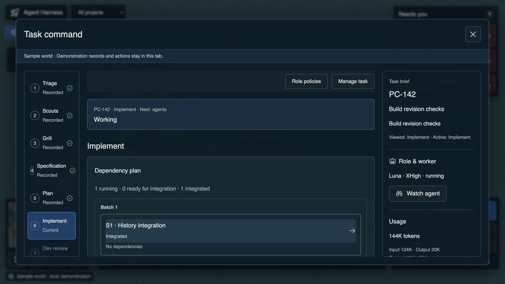
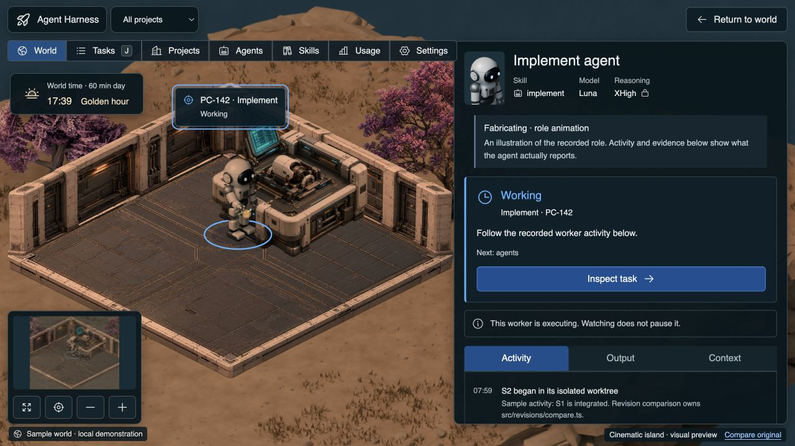

# Laptop usability review

9 September 2026. Recommendations only; no application changes or PR update.

Scope: Task command → Watch an agent in the current living-world development preview, using sample PC-142 records and a temporary 1280 × 720 browser viewport. Both screenshots were saved and reopened for inspection. The viewport override was reset and the temporary audit tab closed afterward. This is a targeted review, not whole-product accessibility qualification or real-run verification.

## 1. Task command — usable, but crowded

The window measures 1200 × 624 pixels. Three independent areas scroll: the stage rail (469 visible / 713 content pixels), main stage content (308 / 836) and task brief (469 / 933). The initial view shows integrated package S1; running S2 is below the visible area. Stage labels and recorded/current/future distinctions are clear. The generic title, separate utility strip, status block and duplicated identity consume space that could show the work itself. Scrollbar affordances are not obvious in the captured initial state.

Recommendation: fit and maximise controls first, then bounded drag resizing with remembered dimensions. Compact the title/actions and stage rail while retaining readable text and the always-open inspector. Give the main content a clear scroll track, preserve one scroll region per necessary column, and remove nested scrolling inside that content where practical. Open at the running/blocked package with a clear way back to the full dependency plan.

## 2. Watch an agent — strong world, buried activity

The agent panel measures about 538 × 619 pixels and contains 1147 pixels of content. The initial viewport is dominated by role, illustration explanation, Working status, Inspect task, and another execution explanation. Recorded activity starts near the bottom, with usage further down. The distinction between illustrative animation and real recorded activity is valuable and should stay.

Recommendation: one compact identity/status area, an inline role-animation label, a compact persistent next action, and a much larger activity area. Show current recorded tool/step, elapsed time, last event age and token usage where they can be scanned without scrolling. Any live activity improvement must use genuine backend events; absence of events must not be described as an agent failure or invented progress.

## Proposed next improvements

1. Laptop window ergonomics and a compact agent panel, as one bounded usability pass. Keep body/control text readable, title/actions accessible and task/evidence semantics intact.
2. Extend the existing Needs you queue with Next decision / Previous decision navigation, preserving explicit confirmation and returning to the same world location.
3. Offer a since-you-last-visited briefing from recorded events: completed work, changed gates, waiting decisions and usage. Mark incomplete coverage rather than guessing.
4. Offer quick task/project search and user-selected watch pins so a few important agents remain easy to follow across projects.
5. Make important world events more legible through brief, meaningful effects: recorded stage advances, available artifacts and required repair. Progression, upgrades and unlocks remain outside this proposal.

The first recommendation is the priority. No recommendation here is an accepted implementation scope yet.

## Accessibility and evidence limits

Native OS scrollbar preferences, keyboard-only scrolling, 200% text zoom and screen-reader interaction were not fully tested. Visible controls and dialog semantics were inspected; this does not establish compliance. Resize/maximise must retain Escape, focus containment for modal dialogs, visible close controls and focus return, following the [WAI dialog pattern](https://www.w3.org/WAI/ARIA/apg/patterns/dialog-modal/). A docked inspector would need non-modal semantics rather than pretending to remain a modal dialog.

Implementation pointers: `src/frontier/ui/forms.css` owns the common window bounds; `workflow.css` owns task height and scrolling; `ui/Modal.tsx` owns the dialog header and focus behavior; `views/AgentPanel.tsx` owns the repeated agent status blocks. These were read from the qualified living-world checkout, whose application source matches the current PR.
